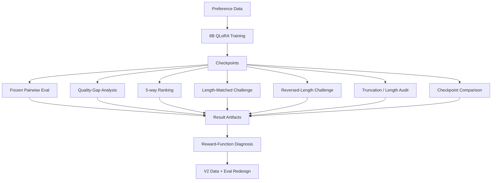

<p align="center">
  
</p>

<p align="center">
  <a href="../README.md"><b>中文完整文档</b></a> ·
  <a href="../README_EN.md"><b>Full English README</b></a> ·
  <a href="../docs/results/"><b>Verified Results</b></a> ·
  <a href="../configs/training/"><b>Training Configs</b></a> ·
  <a href="../tests/"><b>Tests</b></a>
</p>

<p align="center">
  
  
  
  
</p>

---

# Reward Modeling is not finished when accuracy goes up

This repository is an **auditable 8B reward-model post-training project** built around a simple question:

> **Did the reward model learn human preference — or did it learn an easier shortcut that happens to correlate with preference?**

The first training run looked excellent: frozen held-out pairwise accuracy improved from **50.42% to 91.35%**. But a trivial rule — **always prefer the longer response** — scored **94.61%** on the same V1 distribution.

That single observation changed the project. Instead of treating 91.35% as the conclusion, the repository turns the result into something to attack, diagnose and validate.

```text
Train → Evaluate → Attack → Diagnose → Controlled Challenge → Ranking Audit → Redesign
```

The project therefore demonstrates two capabilities at once: **LLM post-training** and **reward-function evaluation**.

---

## 1. Executive summary

<table>
<tr>
<td width="25%" valign="top">

### Model
**Skywork Reward Llama 3.1 8B**

4-bit NF4 QLoRA + BF16 compute.

</td>
<td width="25%" valign="top">

### Hardware
**1× NVIDIA A10 23GB**

~3h18m formal run · ~97.7% mean GPU utilization.

</td>
<td width="25%" valign="top">

### Main result
**50.42% → 91.35%**

+40.93 percentage points on the frozen pairwise test.

</td>
<td width="25%" valign="top">

### Main finding
**Length shortcut exists**

Longer-response heuristic reaches **94.61%** on V1.

</td>
</tr>
</table>

### What was actually completed

- Real 8B reward-model training on a single GPU.
- Pairwise preference learning with frozen evaluation splits.
- Quality-gap analysis and 5-way response ranking reconstruction.
- Length-shortcut attack, length-matched challenge and reversed-length challenge.
- Truncation and reward-vs-length correlation analysis.
- Step-800 vs step-1000 checkpoint comparison.
- Versioned configs, machine-readable result artifacts, plots, tests and CI.

The domain case used for V1 is financial QA, but the public training/evaluation design is built around a generic pairwise preference contract rather than a finance-specific API.

---

## 2. Why this project exists

A reward model receives a prompt and response and produces a scalar score:

```text
reward(question, answer) → score
```

For a preference pair:

```text
(question, chosen, rejected)
```

we want:

```text
reward(question, chosen) > reward(question, rejected)
```

The training objective is the standard pairwise logistic loss:

```text
L = -log sigmoid(r_chosen - r_rejected)
```

Training this objective is straightforward. **Knowing what the learned reward function actually represents is not.**

A model can obtain strong pairwise accuracy for the wrong reason by exploiting artifacts such as response length, formatting, templates or synthetic-data regularities. That matters because the reward model may later be used for **Best-of-N selection, candidate ranking, data filtering, policy optimization or agent/trajectory scoring**.

A biased reward function can therefore become a biased optimization target.

This repository treats evaluation as part of the model itself: the model is not considered trustworthy until its behavior has been tested under controlled distribution changes.

---

## 3. Experiment contract

### Data contract

The public core uses a minimal pairwise schema:

```json
{
  "question": "...",
  "chosen": "...",
  "rejected": "..."
}
```

Additional metadata such as question ID, response quality level and quality gap is retained where needed for ranking reconstruction and diagnostic analysis.

### Data scale

| View | Scale |
|---|---:|
| Training questions | **3,599** |
| Available training preference pairs | **35,990** |
| Pair instances processed by the fixed 1,000-step run | **~8,000** |
| Frozen test questions | **451** |
| Frozen pairwise comparisons | **4,510** |
| Unique test responses | **2,255** |

The full/raw training corpus is intentionally not distributed in the public repository. Public artifacts focus on code, configs, evaluation logic and verified results.

---

## 4. Formal training configuration

The frozen configuration is stored at:

[`configs/training/formal_gpu_qlora_1000_final.json`](../configs/training/formal_gpu_qlora_1000_final.json)

| Component | Setting |
|---|---|
| Base model | Skywork Reward Llama 3.1 8B |
| Training mode | `qlora_4bit` |
| Quantization | 4-bit NF4 + double quantization |
| Compute dtype | BF16 |
| TF32 | Enabled |
| Max sequence length | 512 |
| LoRA rank | 16 |
| LoRA alpha | 32 |
| LoRA dropout | 0.05 |
| Learning rate | 1e-4 |
| Max steps | 1,000 |
| Train batch size | 8 |
| Gradient accumulation | 1 |
| Weight decay | 0.01 |
| Warmup ratio | 0.05 |
| Gradient checkpointing | Enabled |
| Seed | 42 |
| Save / eval interval | every 100 steps |

LoRA is applied to attention and MLP projection modules (`q/k/v/o`, `gate/up/down`), while the reward `score` head is explicitly saved with the adapter.

### Resource profile

| Runtime signal | Observed value |
|---|---:|
| Wall-clock time | **~3h18m** |
| Mean GPU utilization | **~97.7%** |
| Peak allocated training VRAM | **~11.85 GB** |
| GPU | **NVIDIA A10 23GB** |

This was intentionally designed as a **single-GPU reproducible experiment**, not a distributed-training benchmark.

---

## 5. Training behavior

<table>
<tr>
<td width="50%" valign="top">


</td>
<td width="50%" valign="top">


</td>
</tr>
</table>

The training run converged cleanly, while monitor-set accuracy entered an approximate plateau in the second half of training. The trainer selected **step 800** because it had the lowest validation loss, but later ranking analysis showed that this was not automatically the best checkpoint for every downstream metric.

That checkpoint-selection mismatch becomes one of the important findings of the project rather than an implementation detail.

---

## 6. Frozen held-out evaluation

The first high-level result is straightforward:

| Model | Frozen held-out pairwise accuracy |
|---|---:|
| Base reward model | **50.42%** |
| Fine-tuned reward model | **91.35%** |
| Absolute improvement | **+40.93 pp** |

<p align="center">
  
</p>

This is strong evidence that the model adapted to the preference data. It is **not**, by itself, strong evidence that the learned reward function is semantically valid.

That distinction drives the rest of the repository.

---

## 7. Quality-gap analysis

The test set contains preference pairs with different levels of quality separation. The fine-tuned model performs better when the preferred and rejected responses are easier to distinguish.

| Quality gap | Base | Fine-tuned |
|---:|---:|---:|
| 1 | 48.73% | **85.64%** |
| 2 | 50.85% | **94.60%** |
| 3 | 52.00% | **95.68%** |
| 4 | 52.77% | **95.79%** |

<p align="center">
  
</p>

This matters because a single aggregate accuracy hides whether the model can distinguish **subtle preference differences** or only obvious ones.

---

## 8. Ranking evaluation: pairwise accuracy is not enough

The 451 frozen test questions were reconstructed as **5-way ranking problems**. This turns the evaluation from “can the model choose between two responses?” into “can the model order multiple responses consistently?”

| Ranking metric | Result |
|---|---:|
| Kendall τ | **0.8828** |
| NDCG@5 | **0.9474** |
| Perfect 5-way ranking | **57.87%** |
| Level-5 response ranked first | **63.86%** |
| Level-1 response ranked last | **95.57%** |

These metrics expose structure that pairwise accuracy cannot. A reward model can win many independent pairs while still producing a poor global ordering, especially when differences between middle-quality responses are small.

---

## 9. Shortcut audit: the headline metric fails a simple attack

The strongest diagnostic finding in V1 is the response-length artifact.

A trivial heuristic:

```text
choose the longer response
```

achieves:

```text
94.61% pairwise accuracy
```

on the original V1 distribution — **higher than the fine-tuned model's 91.35% IID result**.

That does not mean the reward model learned nothing. It means the original distribution provides an easy shortcut that a model can exploit alongside useful semantic signals.

### Controlled challenge sets

To separate semantic preference learning from length dependence, two challenge sets were introduced.

| Evaluation | Base | Fine-tuned |
|---|---:|---:|
| Length-matched challenge | 49.56% | **77.78%** |
| Reversed-length challenge | 47.70% | **74.90%** |

In the reversed-length set, every preferred response is **shorter** than its rejected counterpart. The fine-tuned model still performs substantially above chance, which supports the conclusion that it learned meaningful preference signal — but not without shortcut dependence.

### Interpretation

```text
High IID accuracy
      │
      ├── useful semantic preference learning  ✓
      │
      └── exploitable response-length artifact ✓
```

The correct conclusion is therefore not “91.35% semantic accuracy.” The correct conclusion is: **V1 learned useful preference structure under a biased data distribution, and the bias is measurable.**

---

## 10. Truncation and reward-length dependence

The formal V1 configuration used:

```text
max_length = 512
```

A later token-length audit found that approximately **98.54% of the 2,255 unique test responses were truncated** under this context length.

The relationship between reward and full response length was also strong:

| Diagnostic | Result |
|---|---:|
| Reward vs full token length · Pearson | **~0.820** |
| Quality-level residualized Pearson | **~0.579** |

This creates an important confound: the model is being asked to judge long answers while seeing only their first 512 tokens, and the data distribution itself strongly correlates length with preference.

V1 therefore treats context length as an **experimental-design limitation**, not merely a throughput parameter.

---

## 11. Checkpoint selection audit

The trainer selected step 800 because it had the lowest monitor-set evaluation loss:

| Checkpoint | Eval loss |
|---|---:|
| Step 800 | **0.11339** |
| Step 1000 | 0.13200 |

But a later controlled BF16 evaluation on the same 2,255 responses found:

| Checkpoint | Pairwise accuracy |
|---|---:|
| Step 800 | 92.20% |
| Step 1000 | **92.64%** |

Step 1000 was also slightly stronger on NDCG@5 and perfect 5-way ranking, while step 800 retained slightly stronger rank-correlation behavior.

The implication is practical:

> **Lowest validation loss is not automatically the best checkpoint for downstream reward-model behavior.**

Checkpoint selection should therefore be tied to the behavior the reward model is expected to support, not a single scalar monitor metric.

---

## 12. Evaluation stack



The evaluation strategy deliberately expands from **IID performance** to **behavior under interventions**. The goal is not to accumulate metrics; it is to identify what causal features the reward model may be using.

---

## 13. Evidence and reproducibility

The repository separates claims from evidence. The public evidence surface includes:

| Evidence type | What it proves |
|---|---|
| Frozen config | Exact post-training hyperparameters and run contract |
| Training curves | Optimization behavior over the formal run |
| Pairwise results | Base vs fine-tuned preference discrimination |
| Ranking metrics | Multi-response ordering quality |
| Challenge sets | Behavior when the length shortcut is controlled or reversed |
| Truncation analysis | Context-window limitation of the formal experiment |
| Checkpoint comparison | Metric-dependent checkpoint behavior |
| Tests / CI | Basic code and data-contract integrity |
| Machine-readable results | Re-analysis without relying on README prose |

### Repository map

```text
reward-modeling-lab/
├── configs/               # frozen training / evaluation configs
├── src/                   # reward-model training and evaluation code
├── scripts/               # experiment and analysis entry points
├── docs/results/          # curated public results and figures
├── tests/                 # unit / contract checks
├── README.md              # complete Chinese research documentation
├── README_EN.md           # complete English documentation
└── .github/README.md      # this recruiter-facing project overview
```

The landing page is intentionally concise enough to scan, while the root READMEs preserve the full experiment documentation.

---

## 14. V1 → V2: what changes next

V2 is not defined as “make the 91.35% number larger.” It is defined as **make the reward function more defensible**.

Planned redesign targets include:

| V1 finding | V2 response |
|---|---|
| Length strongly predicts preference | Length-balanced sampling and counterexamples |
| Verbosity can act as a shortcut | Concise-correct / verbose-wrong pairs |
| Easy pairs inflate aggregate accuracy | Semantic hard negatives and harder quality-gap cases |
| Synthetic preference labels need independent validation | Human-verified gold evaluation |
| 512-token context truncates most responses | 768 / 1024 context ablations |
| Single run cannot establish stability | Multi-seed validation |
| Lowest eval loss may not maximize ranking quality | Ranking-aware checkpoint selection |

The acceptance criterion is therefore broader than IID pairwise accuracy. A better V2 should improve **controlled challenge robustness, human-gold validity, multi-seed stability, truncation behavior and ranking quality**, even if its headline IID score changes only modestly.

---

## 15. What this repository demonstrates

This project is intended to show more than familiarity with LoRA or Hugging Face training scripts.

It demonstrates an end-to-end post-training research workflow:

```text
Problem framing
→ preference-data contract
→ memory-constrained 8B training
→ frozen evaluation
→ shortcut discovery
→ controlled counterfactual tests
→ ranking analysis
→ checkpoint diagnosis
→ evidence packaging
→ experimental redesign
```

The central engineering/research principle is:

> **A reward model is not validated by the score it achieves on the distribution that trained it. It is validated by whether its reward function survives controlled attacks on the shortcuts that distribution makes available.**

---

## 16. Reproduce and inspect

Start from the frozen formal configuration:

[`configs/training/formal_gpu_qlora_1000_final.json`](../configs/training/formal_gpu_qlora_1000_final.json)

Then use:

- **[Chinese full README](../README.md)** for the complete experiment procedure and implementation notes.
- **[English full README](../README_EN.md)** for the English version of the research documentation.
- **[Verified results](../docs/results/)** for curated V1 outputs and plots.
- **[Training configs](../configs/training/)** for versioned run contracts.
- **[Tests](../tests/)** for code/data integrity checks.

<details>
<summary><b>Explicitly outside the completed V1 scope</b></summary>
<br/>

The repository does **not** claim completed:

`GRPO` · `PPO` · multi-node training · multi-GPU distributed training · production reward-model serving benchmarks · online RL deployment

Those are downstream or future directions. Public claims are intentionally limited to experiments that were actually executed and packaged with supporting evidence.

</details>

---

<p align="center">
  <b>Train the model. Attack the metric. Verify the reward.</b><br/>
  <sub>Reward Modeling · Preference Learning · Post-training · Evaluation</sub>
</p>
