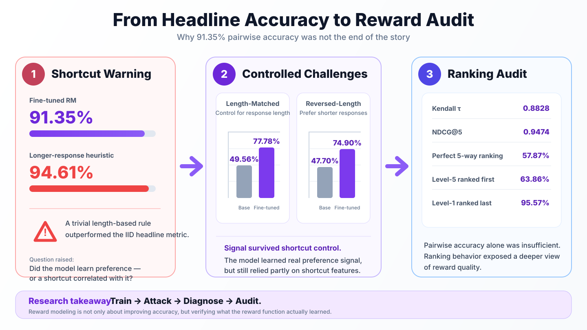
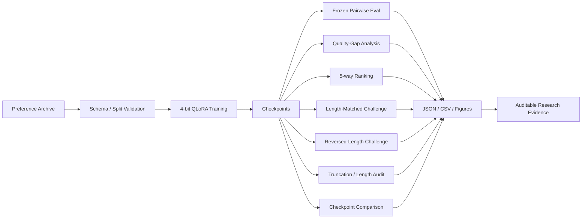

<p align="center">
  
</p>

<p align="center">
  <a href="../README.md"><b>中文完整文档</b></a> ·
  <a href="../README_EN.md"><b>Full English README</b></a> ·
  <a href="../docs/results/"><b>Verified Results</b></a> ·
  <a href="../configs/training/"><b>Training Configs</b></a> ·
  <a href="../tests/"><b>Tests</b></a>
</p>

<p align="center">
  
  
  
  
</p>

---

# Reward Modeling is not finished when accuracy goes up

This repository is an **auditable 8B reward-model post-training project** built around a simple question:

> **Did the reward model learn human preference — or did it learn an easier shortcut that happens to correlate with preference?**

The first training run looked excellent: frozen held-out pairwise accuracy improved from **50.42% to 91.35%**. But a trivial rule — **always prefer the longer response** — scored **94.61%** on the same V1 distribution.

That single observation changed the project. Instead of treating 91.35% as the conclusion, the repository turns the result into something to attack, diagnose and validate.

```text
Train → Evaluate → Attack → Diagnose → Controlled Challenge → Ranking Audit → Redesign
```

The project therefore demonstrates two capabilities at once: **LLM post-training** and **reward-function evaluation**.

---

## Research story — why the headline metric was not enough

<p align="center">
  
</p>

The figure captures the central research move of the project: the **94.61% longer-response heuristic** forced the evaluation to move beyond IID pairwise accuracy, into **controlled challenge sets** and **5-way ranking audits**.

---

## 1. Executive summary

<table>
<tr>
<td width="25%" valign="top">

### Model
**Skywork Reward Llama 3.1 8B**

4-bit NF4 QLoRA + BF16 compute.

</td>
<td width="25%" valign="top">

### Hardware
**1× NVIDIA A10 23GB**

~3h18m formal run · ~97.7% mean GPU utilization.

</td>
<td width="25%" valign="top">

### Main result
**50.42% → 91.35%**

+40.93 percentage points on the frozen pairwise test.

</td>
<td width="25%" valign="top">

### Main finding
**Length shortcut exists**

Longer-response heuristic reaches **94.61%** on V1.

</td>
</tr>
</table>

### What was actually completed

- Real 8B single-GPU reward-model training
- 4-bit NF4 QLoRA + BF16 compute
- frozen pairwise evaluation
- quality-gap analysis
- 5-way ranking reconstruction
- length-matched and reversed-length challenge sets
- truncation and reward-length correlation audits
- step-800 vs step-1000 checkpoint comparison
- versioned configs, result artifacts, tests and CI

---

## 2. Training setup

The formal V1 run uses the frozen configuration in [`configs/training/formal_gpu_qlora_1000_final.json`](../configs/training/formal_gpu_qlora_1000_final.json).

| Component | Configuration |
|---|---|
| Base model | Skywork Reward Llama 3.1 8B |
| Training mode | 4-bit QLoRA |
| Quantization | NF4 + double quantization |
| Compute | BF16 · TF32 enabled |
| LoRA | r=16 · alpha=32 · dropout=0.05 |
| Learning rate | 1e-4 |
| Max steps | 1,000 |
| Batch size | 8 |
| Gradient accumulation | 1 |
| Max length | 512 |
| Seed | 42 |
| Gradient checkpointing | enabled |

The LoRA adapters target attention and MLP projections, while the reward `score` head is saved explicitly with the adapter state.

### Formal GPU run

- **Hardware:** NVIDIA A10 23GB
- **Wall-clock:** ~3h18m
- **Mean GPU utilization:** ~97.7%
- **Peak allocated training VRAM:** ~11.85GB
- **Optimizer steps:** 1,000
- **Training pairs available:** 35,990
- **Approximate pair instances processed in the fixed-step run:** ~8,000

<p align="center">
  
  
</p>

---

## 3. Data contract

Each preference record follows the minimal pairwise contract:

```json
{
  "question": "...",
  "chosen": "...",
  "rejected": "..."
}
```

The V1 data also carries question IDs, response quality levels and quality-gap metadata so the same preference data can support pairwise evaluation, ranking reconstruction and controlled audits.

### Scale

| View | Size |
|---|---:|
| Training questions | 3,599 |
| Available training preference pairs | **35,990** |
| Frozen test questions | **451** |
| Frozen pairwise comparisons | **4,510** |
| Unique test responses | **2,255** |

The public repository does not distribute the raw private training data; it exposes the contract, loaders, configs, metrics and reproducible evaluation logic.

---

## 4. Reward-model objective

For each pair `(question, chosen, rejected)`, the reward model outputs:

```text
r_chosen   = RM(question, chosen)
r_rejected = RM(question, rejected)
```

Training minimizes the pairwise logistic loss:

```text
L = -log sigmoid(r_chosen - r_rejected)
```

The important quantity is therefore the **reward difference**, not whether the absolute reward is positive or negative.

---

## 5. Frozen held-out result

The first headline result is strong:

| Model | Pairwise Accuracy |
|---|---:|
| Base Reward Model | 50.42% |
| Fine-tuned Reward Model | **91.35%** |

**Absolute improvement: +40.93 percentage points.**

<p align="center">
  
</p>

If evaluation stopped here, the obvious conclusion would be that post-training worked extremely well. The next audit shows why that conclusion would be incomplete.

---

## 6. Quality-gap analysis

The model becomes more accurate as the quality difference between preferred and rejected answers increases.

| Quality Gap | Base | Fine-tuned |
|---:|---:|---:|
| 1 | 48.73% | **85.64%** |
| 2 | 50.85% | **94.60%** |
| 3 | 52.00% | **95.68%** |
| 4 | 52.77% | **95.79%** |

<p align="center">
  
</p>

This shows that the model learned useful preference signal, but does not yet tell us **which features** it relied on to make those decisions.

---

## 7. Shortcut audit — the turning point

A trivial heuristic that **always chooses the longer response** reaches:

# **94.61%**

on the original V1 preference distribution.

That is higher than the fine-tuned model's 91.35% IID pairwise score.

This does **not** mean the model learned nothing. It means the original distribution contains a major confounder: response length is highly predictive of the preferred label. The experiment therefore needed controls that deliberately break that correlation.

### Length-matched challenge

Response length is approximately controlled between chosen and rejected answers.

| Model | Accuracy |
|---|---:|
| Base | 49.56% |
| Fine-tuned | **77.78%** |

### Reversed-length challenge

Every preferred response is shorter than its rejected counterpart.

| Model | Accuracy |
|---|---:|
| Base | 47.70% |
| Fine-tuned | **74.90%** |

### Interpretation

The model still performs far above the base model when the easy length cue is neutralized or reversed. Therefore it **did learn real preference signal**. But the performance drop also shows that the fine-tuned reward function relied materially on shortcut features present in V1.

This is the central empirical conclusion of the repository.

---

## 8. Ranking audit

Pairwise accuracy only asks whether one response beats another. A reward model is often used to rank multiple candidates, so the 451 held-out questions were reconstructed as **5-way ranking problems**.

| Ranking metric | Result |
|---|---:|
| Kendall τ | **0.8828** |
| NDCG@5 | **0.9474** |
| Perfect 5-way ranking | **57.87%** |
| Level-5 response ranked first | **63.86%** |
| Level-1 response ranked last | **95.57%** |

The ranking results show that the model learned a strong global ordering signal, while also exposing behavior that pairwise accuracy alone cannot reveal.

---

## 9. Truncation and reward-length audit

The formal V1 configuration used:

```text
max_length = 512
```

A later audit found that approximately **98.54%** of the 2,255 unique test responses were truncated at that context limit.

Reward also correlates strongly with full response length:

- **Pearson correlation:** ~0.820
- **Quality-level residualized Pearson:** ~0.579

These findings turn context length and length dependence into explicit V1 limitations rather than hidden implementation details.

---

## 10. Checkpoint-selection audit

The training loop selected step 800 because it had the lowest validation loss:

| Checkpoint | Eval Loss |
|---|---:|
| Step 800 | **0.11339** |
| Step 1000 | 0.13200 |

A later controlled BF16 evaluation on the same 2,255 responses found:

| Checkpoint | Pairwise Accuracy |
|---|---:|
| Step 800 | 92.20% |
| Step 1000 | **92.64%** |

Step 1000 was also slightly stronger on NDCG@5 and perfect 5-way ranking, while step 800 retained slightly stronger rank-correlation metrics.

**Lesson:** lowest validation loss is not guaranteed to select the checkpoint with the best downstream ranking behavior.

---

## 11. Evaluation stack



The repository is intentionally organized around:

```text
Build → Run → Measure → Attack → Diagnose → Improve
```

rather than "train once and report the best number."

---

## 12. Evidence and reproducibility

| Evidence | Verified scope |
|---|---|
| Real GPU training | 8B model · single A10 23GB · 1,000 optimizer steps |
| Training configuration | frozen JSON config under version control |
| Preference data | 35,990 available pairs · ~8,000 instances processed in formal fixed-step run |
| Frozen evaluation | 451 questions · 4,510 comparisons · 2,255 responses |
| Robustness audit | length heuristic · matched-length · reversed-length challenges |
| Ranking audit | Kendall τ · NDCG@5 · perfect ranking · top/bottom placement |
| Context audit | truncation rate · reward-length correlation |
| Checkpoint audit | step 800 vs step 1000 |
| Public artifacts | figures · curated result tables · configs · tests · CI |

Public result details are collected in [`docs/results/README.md`](../docs/results/README.md).

---

## 13. What this project demonstrates

This repository is intended to prove more than familiarity with PEFT APIs.

### LLM post-training

- pairwise preference learning
- reward-model objectives
- 4-bit QLoRA on an 8B model
- memory-aware single-GPU training
- checkpointing and experiment control

### Evaluation and research engineering

- frozen held-out evaluation
- challenge-set construction
- shortcut diagnosis
- full ranking metrics
- truncation analysis
- checkpoint-selection analysis
- explicit evidence / claim boundaries

### Scientific behavior

The most important engineering decision was to treat a suspiciously strong shortcut baseline as a **reason to invalidate the easy interpretation**, not as something to hide.

---

## 14. V1 limitations

V1 is deliberately documented with its limitations:

1. **Length confounding:** the original preference distribution strongly correlates length with quality.
2. **Context truncation:** 512 tokens truncates ~98.54% of unique held-out responses.
3. **Single seed:** the formal result does not yet establish multi-seed stability.
4. **Domain case:** the first case is financial QA, so transfer to unrelated domains is not claimed.
5. **Synthetic / generated preference artifacts:** data-generation patterns may create exploitable cues beyond length.
6. **Checkpoint selection:** validation loss and downstream ranking metrics do not select exactly the same checkpoint.

These are not footnotes; they directly define the V2 experimental agenda.

---

## 15. V2 roadmap

V2 is designed around **reward validity**, not simply a higher IID score.

| V2 intervention | Purpose |
|---|---|
| Length-balanced preference data | reduce length-label confounding |
| Concise-correct vs verbose-wrong pairs | actively break the shortcut |
| Semantic hard negatives | force content-sensitive discrimination |
| Human-verified gold set | separate model quality from synthetic artifacts |
| 768 / 1024 context ablation | measure truncation sensitivity |
| Multi-seed training | test stability and variance |
| Ranking-aware checkpoint selection | align selection with downstream RM usage |

A V2 model can be scientifically better even if IID pairwise accuracy does **not** increase, provided controlled challenges, human-gold validity, context robustness and seed stability improve.

---

## 16. Repository map

```text
reward-modeling-lab/
├── configs/              # frozen experiment configurations
├── docs/
│   └── results/          # curated public result tables and figures
├── scripts/              # data, training and evaluation entry points
├── src/                  # reward-modeling implementation
├── tests/                # unit / contract tests
├── README.md             # full Chinese research documentation
├── README_EN.md          # full English research documentation
└── .github/README.md     # recruiter-facing flagship landing page
```

---

## 17. Reproduce the formal run

Start from the frozen config:

[`configs/training/formal_gpu_qlora_1000_final.json`](../configs/training/formal_gpu_qlora_1000_final.json)

For exact environment setup, data extraction, training commands, evaluation commands and artifact policy, use:

- **[中文完整文档](../README.md)**
- **[Full English README](../README_EN.md)**
- **[Verified result package](../docs/results/README.md)**

---

<details>
<summary><b>Explicitly not claimed as completed</b></summary>
<br/>

`GRPO` · `PPO` · multi-node training · multi-GPU distributed training · production RM serving benchmarks · online RL deployment

The repository deliberately separates **executed experiments** from future work.

</details>

---

<p align="center">
  <b>A reward model is useful only if its reward survives adversarial inspection.</b>
</p>
