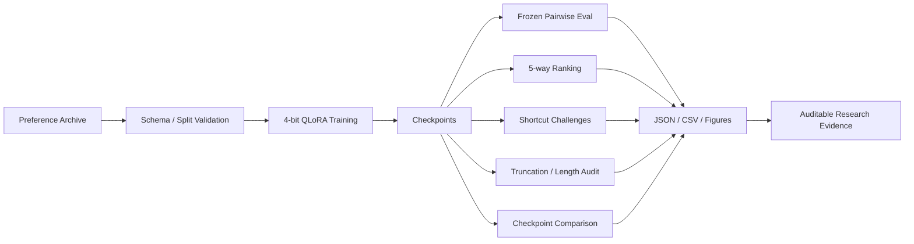

# Reward Modeling Lab

### Auditable 8B LLM Post-training & Reward-Function Evaluation

**Train the reward model, then attack the result to determine what the model actually learned.**

`8B Reward Model` · `4-bit QLoRA` · `Pairwise Preference Learning` · `Ranking Eval` · `Shortcut Audit`

[Full Research README](../README.md) · [Results](../docs/results/) · [Training Configs](../configs/training/) · [Tests](../tests/)

---

## Key Result

A real single-GPU post-training run was completed on **Skywork Reward Llama 3.1 8B** using an **NVIDIA A10 23GB**, 4-bit NF4 QLoRA and BF16 compute.

| Evaluation | Base | Fine-tuned / measured result |
|---|---:|---:|
| Frozen held-out pairwise accuracy | **50.42%** | **91.35%** |
| Length-matched challenge | 49.56% | **77.78%** |
| Reversed-length challenge | 47.70% | **74.90%** |
| 5-way ranking — Kendall τ | — | **0.8828** |
| 5-way ranking — NDCG@5 | — | **0.9474** |

The headline accuracy was **not accepted at face value**: a trivial “prefer the longer response” heuristic reached **94.61%** on the original V1 test distribution. That triggered a second phase of controlled evaluation for shortcut dependence, ranking validity, truncation and checkpoint behavior.

## Research Loop

```mermaid
flowchart LR
    DATA[Preference Data] --> TRAIN[8B QLoRA Training]
    TRAIN --> IID[Frozen IID Evaluation]
    IID --> ATTACK[Shortcut Attack]
    ATTACK --> DIAG[Diagnose Bias / Truncation]
    DIAG --> CHALLENGE[Controlled Challenge Sets]
    CHALLENGE --> RANK[Ranking Evaluation]
    RANK --> REDESIGN[V2 Data + Eval Redesign]
```

The project is intentionally organized around:

> **Train → Attack → Diagnose → Redesign**

rather than “train once and report the best score.”

## Evidence — what is actually completed

| Evidence | Verified scope |
|---|---|
| Real GPU training | 8B model, single A10 23GB, 1,000 optimizer steps |
| Preference data | 35,990 available training pairs; formal run processed ~8,000 pair instances |
| Frozen test | 451 questions, 4,510 comparisons, 2,255 unique responses |
| Reward audit | length shortcut, length-matched and reversed-length challenges |
| Ranking audit | Kendall τ, NDCG@5, perfect 5-way ranking |
| Context audit | truncation and reward-length correlation analysis |
| Checkpoint audit | step-800 vs step-1000 behavioral comparison |
| Reproducibility | versioned configs, machine-readable result artifacts, CI / tests |

### Explicitly not claimed as completed

`GRPO` · `PPO` · multi-node training · multi-GPU distributed training · production RM serving benchmarks · online RL deployment

That boundary is deliberate: the repository distinguishes **executed experiments** from future work.

## Architecture

## Quick Start

The formal run configuration is frozen in:

[`configs/training/formal_gpu_qlora_1000_final.json`](../configs/training/formal_gpu_qlora_1000_final.json)

For environment setup, preference-data preparation, exact training commands, evaluation commands and artifact policy, use the **[full research README](../README.md)**.

---

**A reward model is useful only if its reward function survives adversarial inspection.**

