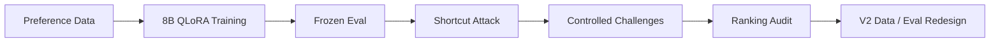
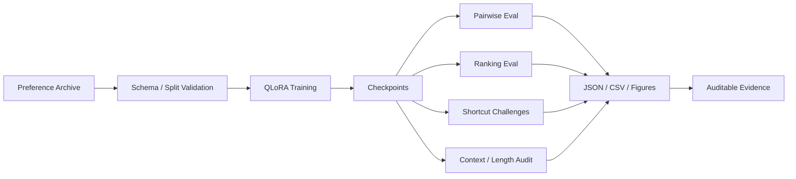

  

  <a href="../README.md"><b>Full Research README</b></a> ·
  <a href="../docs/results/"><b>Results</b></a> ·
  <a href="../configs/training/"><b>Training Configs</b></a> ·
  <a href="../tests/"><b>Tests</b></a>

---

## The result is not the point. The audit is.

The initial fine-tuned reward model reached **91.35%** frozen held-out pairwise accuracy. But a trivial **“prefer the longer response”** heuristic reached **94.61%** on the original V1 test distribution.

That changed the project from a training demo into a reward-function investigation:

<table>
<tr>
<td width="33%" valign="top">

### 01 · Train

**Skywork Reward Llama 3.1 8B**

Single **NVIDIA A10 23GB** · 4-bit NF4 QLoRA · BF16 · **1,000 optimizer steps**.

</td>
<td width="33%" valign="top">

### 02 · Attack

**Challenge the shortcut**

Length-matched, reversed-length, truncation, reward-length correlation and checkpoint tests.

</td>
<td width="33%" valign="top">

### 03 · Verify

**Measure ranking behavior**

Kendall **τ = 0.8828** · NDCG@5 **= 0.9474** · controlled pairwise challenge sets.

</td>
</tr>
</table>

---

## Results that survived deeper inspection

| Evaluation | Base | Fine-tuned / measured |
|---|---:|---:|
| **Frozen held-out pairwise** | 50.42% | **91.35%** |
| **Length-matched challenge** | 49.56% | **77.78%** |
| **Reversed-length challenge** | 47.70% | **74.90%** |
| **Kendall τ · 5-way ranking** | — | **0.8828** |
| **NDCG@5 · 5-way ranking** | — | **0.9474** |

> **Interpretation:** the model clearly learned useful preference signal, but the original distribution also contained a strong exploitable length shortcut. The project therefore reports both the improvement **and** the failure mode.

---

## Research loop

**Train → Attack → Diagnose → Redesign** is the organizing principle of the repository.

---

## Evidence bundle

| What is actually completed | Evidence scope |
|---|---|
| **Real GPU training** | 8B model · single A10 23GB · 1,000 optimizer steps |
| **Preference data** | 35,990 available training pairs · formal run processed ~8,000 pair instances |
| **Frozen test** | 451 questions · 4,510 comparisons · 2,255 unique responses |
| **Shortcut audit** | length heuristic · matched-length · reversed-length challenges |
| **Ranking audit** | Kendall τ · NDCG@5 · perfect 5-way ranking |
| **Context audit** | truncation behavior · reward/full-token-length correlation |
| **Checkpoint audit** | step-800 vs step-1000 behavior |
| **Reproducibility** | versioned configs · machine-readable results · CI / tests |

  
  
  
  

---

## Architecture

---

## Reproduce the formal run

The frozen training configuration is:

[`configs/training/formal_gpu_qlora_1000_final.json`](../configs/training/formal_gpu_qlora_1000_final.json)

Use the **[full research README](../README.md)** for environment setup, data preparation, exact training/evaluation commands and artifact policy.

<b>Explicitly not claimed as completed</b>

 

`GRPO` · `PPO` · multi-node training · multi-GPU distributed training · production RM serving benchmarks · online RL deployment

The repository deliberately separates **executed experiments** from future work.

---

  <b>A reward model is useful only if its reward survives adversarial inspection.</b>

