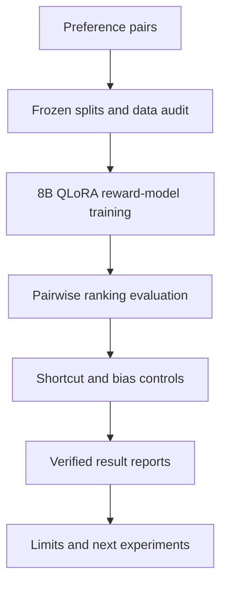

# Architecture

Reward Modeling Lab separates training performance from robustness evidence.

## Components

- Data preparation validates pair structure, splits, and provenance.
- Training uses configuration-controlled 4-bit QLoRA.
- Evaluation reports ranking performance on frozen data.
- Robustness controls test length preference and other exploitable shortcuts.
- Reports distinguish observed GPU runs from proposed experiments.

## Evidence boundary

Only checked-in configurations, logs, result artifacts, and reproducible commands support public metrics.
