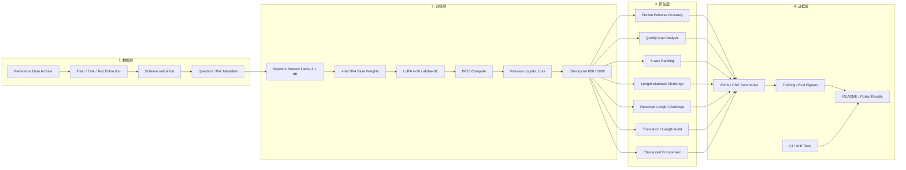

# Reward Modeling & Preference Learning

<p align="right"><b>简体中文</b> | <a href="./README_EN.md">English</a></p>

[](https://github.com/Benjamindaoson/reward-modeling-lab/actions/workflows/ci.yml)
[](LICENSE)
[](pyproject.toml)
[](docs/results/README.md)

一个可审计、可复现的 **8B Reward Model 后训练与评估项目**，覆盖 Pairwise Preference Learning、4-bit QLoRA、排序评估、Shortcut Audit、Checkpoint Analysis 与实验结果治理。

首个 Domain Case 是**金融问答**，但公开的训练与评估核心采用通用 Pairwise Preference Contract，并不绑定金融领域接口。

---

## 项目摘要

V1 已完成真实 GPU 训练：基于 **Skywork Reward Llama 3.1 8B**，在单张 **NVIDIA A10 23GB** 上使用 **4-bit NF4 QLoRA + BF16 Compute** 完成 1,000 个 optimizer steps。

### 核心结果

| 模型 | Frozen Held-out Pairwise Accuracy |
|---|---:|
| Base Reward Model | 50.42% |
| Fine-tuned Reward Model | **91.35%** |

**绝对提升：+40.93 percentage points**

冻结测试集包含：

- **451** 个独立问题
- **4,510** 个 Preference Pairs
- **2,255** 个 Unique Responses

### 为什么这个项目不只是一次“把准确率训高”的 Demo

V1 在 IID Test 上做到 91.35% 后，并没有把这个数字直接当作结论。

后续审计发现：一个极其简单的规则——**永远选择更长的回答**——在原始 V1 Test Distribution 上就可以达到 **94.61%**。这说明数据中存在非常明显的 Length Shortcut。

因此项目继续增加了 Controlled Challenge Set、5-way Ranking、Truncation Audit、Reward-Length Correlation 与 Checkpoint Control，用来回答更重要的问题：

> **Reward Model 到底学到了什么？它奖励的是回答质量，还是数据里的表面捷径？**

目前已验证的关键结果：

- **Length-Matched Challenge：** 49.56% → **77.78%**
- **Reversed-Length Challenge：** 47.70% → **74.90%**
- **Kendall tau：** **0.8828**
- **NDCG@5：** **0.9474**
- **Perfect 5-way Ranking：** **57.87%**
- **512 tokens 下整体截断率：** **98.54%**
- **Reward vs Full Token Length Pearson：** **0.8204**
- **Step 800 BF16 Pairwise：** 92.20%
- **Step 1000 BF16 Pairwise：** **92.64%**

这个项目最终形成的核心认识是：

> **Reward Modeling 不只是把 Pairwise Loss 降下来，更重要的是验证模型学到的 Reward Function 是否真的在奖励我们希望它奖励的行为。**

---

## V1 → Audit → V2：项目研究故事

整个项目刻意采用 **Train → Attack → Diagnose → Redesign** 的闭环，而不是在拿到第一个漂亮 IID 指标后结束。

```mermaid
flowchart LR
    subgraph V1["V1 — 构建与训练"]
        A1[35,990 Preference Pairs] --> A2[8B Reward Model]
        A2 --> A3[4-bit NF4 QLoRA + BF16]
        A3 --> A4[Single A10 23GB]
        A4 --> A5[1,000 Optimizer Steps]
        A5 --> A6[50.42% → 91.35% Pairwise]
    end

    subgraph AUDIT["Audit — 主动攻击结果"]
        B1[Length Heuristic = 94.61%]
        B2[Length-Matched = 77.78%]
        B3[Reversed-Length = 74.90%]
        B4[98.54% Truncation]
        B5[Reward-Length Pearson = 0.8204]
        B6[Step 800 vs 1000 Selection Mismatch]
    end

    subgraph V2["V2 — 为 Reward Validity 重构"]
        C1[Length-Balanced Data]
        C2[Concise-Correct / Verbose-Wrong]
        C3[Semantic Hard Negatives]
        C4[Human Gold Set]
        C5[768 / 1024 Context Ablation]
        C6[Multi-Seed Validation]
        C7[Ranking-Aware Checkpoint Selection]
    end

    A6 --> B1
    B1 --> B2
    B2 --> B3
    B3 --> B4
    B4 --> B5
    B5 --> B6
    B6 --> C1
    C1 --> C2
    C2 --> C3
    C3 --> C4
    C4 --> C5
    C5 --> C6
    C6 --> C7
```



V2 的目标不是单纯把 IID Accuracy 再刷高一点。即使 V2 的 IID Accuracy 与 V1 接近，只要 Controlled Challenge、Human Gold、Multi-seed Stability、Truncation 与 Reward-Length Dependence 明显改善，就可以认为 Reward Function 更可信。

---

## 目录

- [1. 项目动机](#1-项目动机)
- [2. 已验证范围](#2-已验证范围)
- [3. 系统架构](#3-系统架构)
- [4. Preference Data Contract](#4-preference-data-contract)
- [5. Reward Modeling 训练目标](#5-reward-modeling-训练目标)
- [6. 正式训练配置](#6-正式训练配置)
- [7. 单卡性能优化](#7-单卡性能优化)
- [8. 正式训练运行情况](#8-正式训练运行情况)
- [9. Evaluation Stack](#9-evaluation-stack)
- [10. Frozen Held-out Results](#10-frozen-held-out-results)
- [11. Quality-Gap 分层分析](#11-quality-gap-分层分析)
- [12. 5-way Ranking Evaluation](#12-5-way-ranking-evaluation)
- [13. Shortcut Robustness Audit](#13-shortcut-robustness-audit)
- [14. Truncation 与 Length-Bias Audit](#14-truncation-与-length-bias-audit)
- [15. Checkpoint Selection Audit](#15-checkpoint-selection-audit)
- [16. 仓库结构](#16-仓库结构)
- [17. 安装](#17-安装)
- [18. 数据准备](#18-数据准备)
- [19. 运行训练与评估](#19-运行训练与评估)
- [20. 配置文件](#20-配置文件)
- [21. Tests 与 CI](#21-tests-与-ci)
- [22. 可复现性与 Artifact Policy](#22-可复现性与-artifact-policy)
- [23. 已知限制](#23-已知限制)
- [24. V2 Roadmap](#24-v2-roadmap)
- [25. License](#25-license)

---

## 1. 项目动机

很多 LLM Post-training 问题并不存在唯一标准答案，但人类通常可以稳定表达相对偏好：

```text
Question
  ├── Response A
  └── Response B

Preference: A > B
```

Reward Model 学习一个标量函数：

```text
reward(question, answer) -> score
```

使 Preferred Response 获得高于 Rejected Response 的 Reward。

这类 Reward Model 可以用于：

- Pairwise Candidate Ranking
- Best-of-N Selection
- Preference Data Filtering
- Downstream Policy Optimization
- Agent / Trajectory Scoring
- Reward Function Diagnostics

真正困难的地方并不只是把模型训起来。Reward Model 完全可能因为错误原因获得很高的 Benchmark Score，例如依赖：

- Response Length
- Format / Style
- 固定模板
- Synthetic Data Generation Artifact

因此，本项目把 **Evaluation 与 Reward Audit** 作为和训练同等重要的一等公民，而不是训练完成后的附加步骤。

---

## 2. 已验证范围

### V1 已真实执行

- Pairwise Reward Model Training
- 单张 NVIDIA GPU 上的 4-bit QLoRA
- Frozen Held-out Evaluation
- Quality-Gap Analysis
- 5-way Ranking Reconstruction
- Length Shortcut Audit
- Length-Matched Challenge
- Reversed-Length Challenge
- Truncation Analysis
- Reward-Length Correlation Analysis
- Step 800 vs Step 1000 Checkpoint Comparison
- Lightweight CI / Unit Tests
- Public Experiment Result Packaging

### V1 明确不宣称已经完成

- GRPO Training
- PPO Training
- Multi-node Training
- Multi-GPU Distributed Training
- Production Reward Model Serving Benchmark
- Online RL Deployment

这个边界是刻意保留的：仓库只公开并声称 **V1 真正执行过的实验与工程链路**。

---

## 3. 系统架构

已验证 Pipeline 分为四层：**数据层、训练层、评估层、证据层**。



### 各层职责

1. **数据层**：提取并校验 Pairwise Preference Records，保留 Ranking / Audit 所需元数据。
2. **训练层**：加载 Base Reward Model，配置 QLoRA，使用 Pairwise Loss 训练并保存 Checkpoint。
3. **评估层**：覆盖 IID Pairwise、Quality Gap、完整排序、Robustness Challenge、Truncation 和 Checkpoint Behavior。
4. **证据层**：保存轻量 Metrics、Figures、Configs、Tests 与机器可读结果，保证实验可追溯。

---

## 4. Preference Data Contract

公开核心所需最小 Schema：

```json
{
  "question": "...",
  "chosen": "...",
  "rejected": "..."
}
```

V1 实验数据还包含 Question ID、Response Quality Level、Quality Gap 等元数据，用于 Ranking 与 Audit。

Data Loader 会验证每条记录至少包含非空字符串：

```text
question
chosen
rejected
```

公开 Extraction Utility 期望输入一个包含 train / eval / test JSONL 的 preference-data archive，并将所需文件提取到：

```text
data/preferences/
```

### V1 数据规模

| 数据视图 | 规模 |
|---|---:|
| Training Questions | 3,599 |
| 可用 Training Preference Pairs | **35,990** |
| Formal Run 实际处理 Pair Instances | **~8,000** |
| Frozen Test Questions | **451** |
| Frozen Test Pairwise Comparisons | **4,510** |
| Unique Test Responses | **2,255** |

这里必须区分：**数据集总共有 35,990 个 Pair**，但固定 1,000-step 的正式实验并没有完整遍历全部数据，只处理了约 8,000 个 pair instances。

原始 / 私有训练数据不会随公开仓库分发。

---

## 5. Reward Modeling 训练目标

每个 Preference Pair：

```text
(question, chosen, rejected)
```

Reward Model 分别输出：

```text
r_chosen   = RM(question, chosen)
r_rejected = RM(question, rejected)
```

训练使用 Pairwise Logistic Objective：

```text
L = -log sigmoid(r_chosen - r_rejected)
```

目标是：

```text
r_chosen > r_rejected
```

因此 Pairwise RM 更关心 Reward Difference，而不是绝对 Reward 是否大于 0。即使 chosen reward 是负数，只要它高于 rejected reward，排序仍然正确。

---

## 6. 正式训练配置

冻结正式配置：

[`configs/training/formal_gpu_qlora_1000_final.json`](configs/training/formal_gpu_qlora_1000_final.json)

### Model / Precision

| 参数 | 值 |
|---|---|
| Base Model | Skywork Reward Llama 3.1 8B |
| Training Mode | `qlora_4bit` |
| Weight Storage | 4-bit |
| Quantization | NF4 |
| Double Quantization | Enabled |
| Compute dtype | BF16 |
| TF32 | Enabled |
| Gradient Checkpointing | Enabled |

### LoRA

| 参数 | 值 |
|---|---:|
| Rank `r` | 16 |
| Alpha | 32 |
| Dropout | 0.05 |
| Modules to Save | `score` |

Target Modules：

```text
q_proj
k_proj
v_proj
o_proj
gate_proj
up_proj
down_proj
```

### Optimization

| 参数 | 值 |
|---|---:|
| Learning Rate | `1e-4` |
| Max Optimizer Steps | 1,000 |
| Weight Decay | 0.01 |
| Warmup Ratio | 0.05 |
| Max Grad Norm | 1.0 |
| Seed | 42 |
| Train Micro-batch | 8 |
| Gradient Accumulation | 1 |
| Effective Batch Size | **8** |
| Eval Batch Size | 8 |
| Logging Interval | 10 steps |
| Eval Interval | 100 steps |
| Save Interval | 100 steps |
| Save Total Limit | 2 |
| Max Sequence Length | **512** |

---

## 7. 单卡性能优化

正式模型在一张 **NVIDIA A10 23GB** 上训练。

在冻结最终 Batch 配置前，固定 Effective Batch Size=8，对多组 Micro-batch / Gradient Accumulation 做了 Profiling：

| Micro-batch | Grad Accum | Effective Batch | Approx. sec / step |
|---:|---:|---:|---:|
| 1 | 8 | 8 | 13.92 |
| 2 | 4 | 8 | 11.59 |
| 4 | 2 | 8 | 10.90 |
| **8** | **1** | **8** | **10.45** |

最终采用：

```text
per_device_train_batch_size = 8
gradient_accumulation_steps = 1
```

相比 micro-batch=1 / accumulation=8，Step Time 约下降 **25%**，同时保持相同 Effective Batch。

优化目标不是“把显存塞满”，而是在单 GPU 条件下减少不必要的 accumulation overhead，保持较高计算利用率。

---

## 8. 正式训练运行情况

| 指标 | 数值 |
|---|---:|
| Hardware | NVIDIA A10 23GB |
| Optimizer Steps | **1,000** |
| Effective Batch | 8 |
| Approx. Pair Instances Processed | **8,000** |
| Wall-clock Time | **03:18:51** |
| Mean GPU Utilization | **97.73%** |
| Peak Allocated Training VRAM | **~11.85GB** |

这证明 8B Reward Model 可以在单张 23GB GPU 上通过 QLoRA 完成有效领域适配，而不必为了这个规模强行引入 Multi-GPU Infrastructure。

---

## 9. Evaluation Stack

V1 不只看一个 Pairwise Accuracy，而是分五层验证 Reward Model。

### Level 1 — Frozen IID Pairwise Evaluation

判断未见过的 Held-out Pair 是否满足：

```text
reward(chosen) > reward(rejected)
```

### Level 2 — Quality-Gap Evaluation

分析随着 Preference Quality Gap 增大，Accuracy 与 Reward Margin 如何变化。

### Level 3 — 5-way Ranking Evaluation

把每个问题的五个质量等级回答恢复成完整排序，并使用：

- Kendall tau
- Spearman Rank Correlation
- NDCG@5
- Top-1 / Bottom-1 Accuracy
- Perfect 5-way Ranking

### Level 4 — Shortcut Robustness

当最明显的 Shortcut——Response Length——被控制或反转以后，检查模型是否仍保留有效 Ranking Ability。

### Level 5 — Bias Diagnostics

重点检查：

- Truncation Rate
- Reward-Length Correlation
- Checkpoint Disagreement
- Validation Loss 与 Ranking Metric 的 Model Selection Mismatch

---

## 10. Frozen Held-out Results

冻结测试集：

- **451 independent questions**
- **4,510 preference pairs**
- **2,255 unique responses**

| Metric | Base | Fine-tuned |
|---|---:|---:|
| Pairwise Accuracy | 50.42% | **91.35%** |
| Mean Reward Margin | 0.487 | **11.284** |

绝对提升：

```text
+40.93 percentage points
```


### 训练曲线


### Monitor 曲线


---

## 11. Quality-Gap 分层分析

Quality Gap 越大，理论上两个回答越容易区分。

| Quality Gap | Records | Base Accuracy | Fine-tuned Accuracy | Fine-tuned Mean Margin |
|---:|---:|---:|---:|---:|
| 1 | 1,804 | 48.73% | **85.64%** | 5.60 |
| 2 | 1,353 | 50.85% | **94.60%** | 11.33 |
| 3 | 902 | 52.00% | **95.68%** | 17.00 |
| 4 | 451 | 52.77% | **95.79%** | 22.41 |


Fine-tuned Reward Margin 随 Gap 单调增加，为模型学到 Ordinal Preference Structure 提供了一层证据，而不只是二元分类边界。

---

## 12. 5-way Ranking Evaluation

451 个问题被恢复成五回答排序任务。

Selected Model 的结果：

| Metric | Result |
|---|---:|
| Pairwise Accuracy | ~91.37% |
| Kendall tau | **0.8828** |
| NDCG@5 | **0.9474** |
| Perfect 5-way Ranking | **57.87%** |
| Level-5 Response Ranked First | **63.86%** |
| Level-1 Response Ranked Last | **95.57%** |

为什么要做这层评估：

一个模型可以在很多二选一 Pair 上判断正确，但整体五项排序仍可能不一致。Listwise Metrics 可以检查 Reward Surface 是否真的保持了预期的质量顺序。

简历与项目首页的主指标仍保持 Frozen A10 Formal Test：**50.42% → 91.35%**；5-way Ranking 作为补充证据。

---

## 13. Shortcut Robustness Audit

### 发现：原始数据存在严重 Length Shortcut

一个非常简单的规则：

```text
永远选择更长的回答
```

在原始 V1 Test Distribution 上达到：

```text
94.61% accuracy
```

甚至高于 Fine-tuned RM 的 IID Pairwise Accuracy。

因此，91.35% 不能直接解释成“91.35% 的无偏语义偏好判断能力”。

### Length-Matched Challenge

筛选规则：

```text
relative chosen/rejected length difference <= 10%
```

Challenge Set：

- **450 pairs**
- **340 unique questions**
- 442 个 Gap-1 Pair
- 8 个 Gap-2 Pair

| Model | Accuracy | Mean Reward Margin |
|---|---:|---:|
| Base | 49.56% | 0.05 |
| Fine-tuned | **77.78%** | **4.21** |

绝对提升：

```text
+28.22 percentage points
```

### Reversed-Length Challenge

筛选规则：

```text
chosen response is shorter than rejected response
```

Challenge Set：

- **239 pairs**
- **205 unique questions**
- 239 / 239 都是 Gap 1
- Length-only Heuristic Accuracy = **0%**

| Model | Accuracy | Mean Reward Margin |
|---|---:|---:|
| Base | 47.70% | -0.20 |
| Fine-tuned | **74.90%** | **3.68** |

绝对提升：

```text
+27.20 percentage points
```

### 更严谨的解释

Challenge 结果同时支持两件事：

1. V1 Preference Protocol 的确包含显著 Length Artifact；
2. 在压制或反转 Length Shortcut 后，Fine-tuned RM 仍保留显著 Ranking Ability。

但 Challenge Set 高度集中在最难的 Gap-1 样本，因此 IID → Challenge 的全部下降不能都归因于 Length Bias。

---

## 14. Truncation 与 Length-Bias Audit

Formal Experiment 使用：

```text
max_length = 512
```

后续完整 Token-Length Audit 发现：

```text
98.54%
```

的 **2,255 unique test responses** 被截断。

这是 V1 最重要的设计限制之一。

额外诊断：

| Diagnostic | Value |
|---|---:|
| Reward vs Full Token Length Pearson | **0.8204** |
| Quality-Level Residualized Pearson | **0.5791** |

这说明：

- V1 中高质量标签与回答长度高度纠缠；
- Reward Model 本身也表现出明显的 Reward-Length Association；
- 下一版必须同时修复 **数据构造** 与 **Context Length**。

这一问题被主动公开，而不是用 91.35% 的漂亮 IID 数字掩盖。

---

## 15. Checkpoint Selection Audit

Trainer 因为 Step 800 的 Monitor Eval Loss 最低，所以最终恢复 Step 800：

| Checkpoint | Eval Loss |
|---|---:|
| Step 800 | **0.11339** |
| Step 1000 | 0.13200 |

后续又在统一 BF16 Base 环境下，对同一批 2,255 Responses 进行 Controlled Evaluation：

| Metric | Base BF16 | Step 800 | Step 1000 |
|---|---:|---:|---:|
| Pairwise Accuracy | 52.24% | 92.20% | **92.64%** |
| Kendall tau | 0.0515 | **0.8875** | 0.8853 |
| Spearman | 0.0638 | **0.9417** | 0.9329 |
| NDCG@5 | 0.7379 | 0.9489 | **0.9501** |
| Level-5 Top-1 | 17.74% | 65.63% | **67.85%** |
| Perfect 5-way | 2.00% | 59.65% | **63.41%** |

Step 800 vs Step 1000：

- Pair Ranking Disagreements：**84 / 4,510**
- Step 1000 更好的 Questions：**33**
- Step 800 更好的 Questions：**13**
- Pairwise Accuracy 相同：**405**

这里的结论并不是“Step 1000 全面优于 Step 800”，而是：

> **最低 Validation Loss 不一定对应最佳 Downstream Ranking Checkpoint。**

这直接推动了 V2 的 Ranking-aware Checkpoint Selection 设计。

---

## 16. 仓库结构

```text
.
├── .github/
│   └── workflows/
│       └── ci.yml
├── configs/
│   └── training/
│       ├── formal_gpu_qlora_1000_final.json
│       ├── single_gpu_qlora.json
│       ├── smoke_gpu_qlora.json
│       └── speed_probe_*.json
├── docs/
│   └── results/
│       ├── README.md
│       ├── data/
│       └── figures/
├── scripts/
│   ├── run_all_on_gpu.sh
│   └── setup_gpu_environment.sh
├── src/
│   └── financial_reward_rl/
│       ├── cli.py
│       ├── data.py
│       ├── evaluate.py
│       ├── evaluation_suite.py
│       ├── model_artifacts.py
│       ├── model_setup.py
│       ├── preflight.py
│       └── train.py
├── tests/
│   ├── test_model_artifacts.py
│   └── test_single_gpu_qlora.py
├── LICENSE
├── README_EN.md
├── pyproject.toml
└── README.md
```

### 核心模块

- `data.py`：Preference Split Extraction、JSONL Validation、Data Summary。
- `preflight.py`：训练环境、GPU、数据路径与模型路径检查。
- `model_setup.py`：Base Model Setup Helpers。
- `model_artifacts.py`：Base / Adapter Artifact Resolution。
- `train.py`：QLoRA Loading Plan、Pairwise Reward Training、Checkpointing。
- `evaluate.py`：Held-out Pairwise Evaluation 入口。
- `evaluation_suite.py`：Ranking、Challenge 与 Audit 相关扩展评估逻辑。

---

## 17. 安装

### 环境要求

- Python **3.11+**
- Published 4-bit QLoRA 路径需要 NVIDIA GPU
- CUDA-compatible PyTorch
- 本地或下载好的 Base Reward Model

### 创建虚拟环境

```bash
python -m venv .venv
source .venv/bin/activate
python -m pip install --upgrade pip
```

### 安装项目

```bash
pip install -e ".[train]"
```

`train` optional dependency 包含 PyTorch、Transformers、PEFT、bitsandbytes、Accelerate、datasets 等训练依赖。

GPU 环境下，建议先根据本机 CUDA Driver 安装匹配的 PyTorch Build。

---

## 18. 数据准备

端到端脚本需要一个 Preference Data Archive：

```bash
export PREFERENCE_DATA_ARCHIVE=/path/to/preference_data.zip
```

CLI 会把 train / eval / test 拆分到：

```text
data/preferences/
```

也可以独立运行数据命令。

### 提取数据

```bash
reward-modeling prepare-data \
  --archive /path/to/preference_data.zip \
  --output-dir data/preferences
```

### 校验 / 汇总 Split

```bash
reward-modeling summarize-data \
  --data data/preferences/train.jsonl
```

V1 原始训练数据不会包含在公开仓库中。

---

## 19. 运行训练与评估

### 指定 Base Model

```bash
export MODEL_PATH=/path/to/base-reward-model
```

### 指定 Training Config

公开 Runner 默认使用：

```text
configs/training/single_gpu_qlora.json
```

如果要复现 Formal Config：

```bash
export TRAINING_CONFIG=configs/training/formal_gpu_qlora_1000_final.json
```

### 运行完整单卡链路

```bash
bash scripts/run_all_on_gpu.sh
```

脚本执行：

```text
prepare data
    -> summarize data
    -> GPU/model preflight
    -> single-GPU Reward Model training
    -> held-out evaluation
```

### 从 Checkpoint 恢复

```bash
export RESUME_FROM_CHECKPOINT=/path/to/checkpoint
bash scripts/run_all_on_gpu.sh
```

### 可选自动环境安装

```bash
export AUTO_SETUP=1
export TORCH_INDEX_URL=<cuda-compatible-pytorch-index>
bash scripts/run_all_on_gpu.sh
```

---

## 20. 配置文件

仓库把不同用途的 Config 分开管理：

| Config | 用途 |
|---|---|
| `single_gpu_qlora.json` | 默认公开的单卡 QLoRA 路径 |
| `formal_gpu_qlora_1000_final.json` | V1 冻结正式配置 |
| `smoke_gpu_qlora.json` | Smoke Validation |
| `speed_probe_batch2.json` | Batch Profiling |
| `speed_probe_batch4.json` | Batch Profiling |
| `speed_probe_batch8.json` | Batch Profiling |
| `speed_probe_evalbatch8.json` | Eval Batch Profiling |

Smoke、Profiling 与 Formal Config 分离，可以避免把工程检查与正式实验结果混在一起。

---

## 21. Tests 与 CI

GitHub Actions 会在 push / pull request 到 `main` 时运行。

当前矩阵：

```text
Python 3.11
Python 3.12
```

CI 执行：

1. Checkout Repository
2. Setup Python
3. Editable Package Installation
4. `tests/` 下的 Unit Test Discovery
5. Compile Public Python Sources

当前轻量测试覆盖：

- Adapter / Base Model Artifact Resolution
- QLoRA Loading Plan
- NF4 Quantization Settings
- LoRA Rank Configuration
- Full-precision Flag Behavior

CI 不会在 GitHub-hosted CPU Runner 上尝试真实 8B GPU Training。

---

## 22. 可复现性与 Artifact Policy

公开仓库保留足够的轻量证据，让主要结果可以被检查，同时避免上传模型权重和私有数据。

### Included

- Frozen Training Configs
- Result Summaries
- Quality-Gap CSV
- Shortcut-Audit JSON
- Checkpoint-Comparison JSON
- Training / Evaluation Figures
- Unit Tests
- CI Workflow

### Excluded from Git

- Base Model Weights
- LoRA Adapter Checkpoints
- Optimizer States
- Raw / Private Preference Data
- Large Local Experiment Archives
- Runtime Logs / Caches

详细公开结果：

**[docs/results/README.md](docs/results/README.md)**

机器可读结果：

```text
docs/results/data/
```

---

## 23. 已知限制

V1 主动公开 Failure Modes，而不是只展示漂亮指标。

### 1. Preference Protocol 存在严重 Length Artifact

Longer-answer heuristic = 94.61%，说明回答长度与 Preference Label 高度相关。

### 2. 512 Tokens 下严重截断

98.54% 的 Unique Test Responses 超过 Formal Context Budget 并被截断。

### 3. Synthetic Preference Artifact 可能不止长度

V1 最完整审计的是 Length Shortcut，但 Format、Style、Generation Template 也可能存在其他 Shortcut。

### 4. 正式实验只有一个 Seed

Frozen Formal Experiment 使用 seed=42。Multi-seed Stability 是 V2 必做项。

### 5. Hyperparameter Search 有限

V1 做了有针对性的 Profiling，但不是完整的 LR / LoRA Rank / Context Grid Search。

### 6. Fixed-step Training 没有完整消费全部训练集

1,000 steps × effective batch 8 ≈ 8,000 pair instances，而训练集共有 35,990 Preference Pairs。

### 7. Early Stopping 配置实际上无法有效触发

Eval every 100 steps、总共 1,000 steps，但 patience=20，因此 V1 的 Early Stopping 基本没有实际作用。

这些不是隐藏 Caveat，而是项目主要结论的一部分。

---

## 24. V2 Roadmap

V2 的目标是提高 **Reward Validity**，而不是只追求更高 IID Score。

### Data

- Length-balanced Preference Pairs
- Concise-Correct vs Verbose-Wrong
- Reversed-Length Hard Negatives
- Semantic Hard Negatives
- Format-Controlled Examples
- Human-verified Gold Evaluation Set

### Context

计划 Ablation：

```text
512
768
1024
```

如果 1024 后 Truncation 仍高，则继续扩展。

### Stability

至少跑多个 Seed，例如：

```text
42
123
2026
```

最终报告 Mean ± Std。

### Checkpoint Selection

不再只根据最低 Eval Loss 选模型，而是结合：

- Pairwise Accuracy
- NDCG@5
- Kendall tau
- Challenge Accuracy
- Robustness Guardrails

### V2 Success Criterion

即使 V2 的 IID Accuracy 相同或略低，只要同时满足：

- Controlled Challenge 更强
- Human Gold 更强
- Reward-Length Dependence 更低
- Truncation 明显减少
- Multi-seed 更稳定

就应该认为 V2 的 Reward Function 比 V1 更可信。

---

## 25. License

项目使用 [MIT License](LICENSE)。

---

## 核心指标总览

| 类别 | 指标 | 结果 |
|---|---|---:|
| Formal | Base Pairwise Accuracy | 50.42% |
| Formal | Fine-tuned Pairwise Accuracy | **91.35%** |
| Formal | Absolute Improvement | **+40.93pp** |
| Ranking | Kendall tau | **0.8828** |
| Ranking | NDCG@5 | **0.9474** |
| Ranking | Perfect 5-way | **57.87%** |
| Shortcut | Longer-answer Heuristic | **94.61%** |
| Robustness | Length-Matched Fine-tuned | **77.78%** |
| Robustness | Reversed-Length Fine-tuned | **74.90%** |
| Bias | Overall Truncation | **98.54%** |
| Bias | Reward-token Pearson | **0.8204** |
| Checkpoint | Step 800 BF16 Pairwise | 92.20% |
| Checkpoint | Step 1000 BF16 Pairwise | **92.64%** |
| Training | Wall-clock Time | **03:18:51** |
| Training | Mean GPU Utilization | **97.73%** |
| Training | Peak Allocated VRAM | **~11.85GB** |

> **核心结论：一个高分 Reward Model 只有在我们能解释它究竟在奖励什么时，才真正有价值。**
