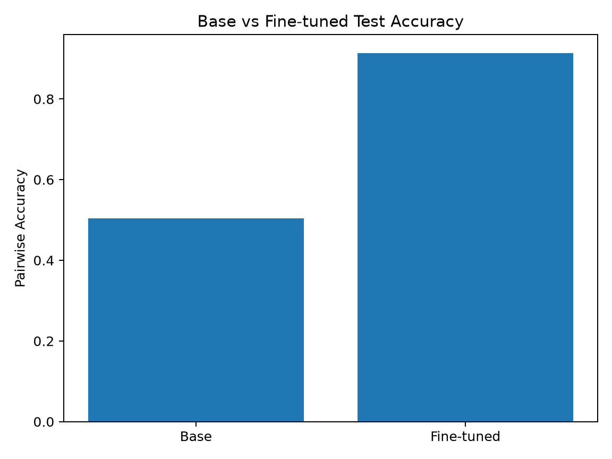
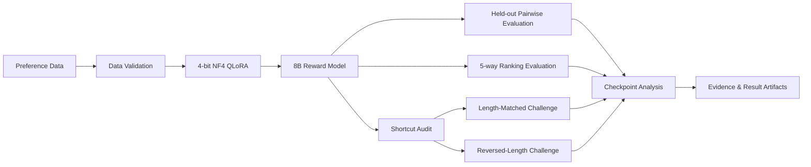

# Reward Modeling & Preference Learning

[](https://github.com/Benjamindaoson/reward-modeling-lab/actions/workflows/ci.yml)
[](LICENSE)
[](pyproject.toml)
[](docs/results/README.md)

An auditable **8B Reward Model post-training project** covering pairwise preference learning, 4-bit QLoRA, robust evaluation, shortcut auditing, and checkpoint analysis.

The first domain case is financial question answering.

## Highlights

- Skywork Reward Llama 3.1 8B
- Single NVIDIA A10 23GB
- 4-bit NF4 QLoRA + BF16 compute
- 1,000 optimizer steps
- ~3h18m formal training
- ~97.7% mean GPU utilization
- ~11.85GB peak allocated training VRAM
- Frozen held-out Pairwise Accuracy: **50.42% → 91.35%**
- Kendall tau: **0.8828**
- NDCG@5: **0.9474**
- Length-Matched Challenge: **77.78%**
- Reversed-Length Challenge: **74.90%**

## Main Result

| Model | Pairwise Accuracy |
|---|---:|
| Base Reward Model | 50.42% |
| Fine-tuned Reward Model | **91.35%** |

The frozen test contains **451 independent questions**, **4,510 preference pairs**, and **2,255 unique responses**.



## Why the 91.35% result is not the whole story

A simple heuristic that always selects the longer answer achieves **94.61%** on the original V1 test distribution.

This exposed a strong response-length shortcut, so additional controlled evaluations were added:

| Evaluation | Base | Fine-tuned |
|---|---:|---:|
| Length-Matched | 49.56% | **77.78%** |
| Reversed-Length | 47.70% | **74.90%** |

A later audit also found that **98.54%** of unique test responses were truncated under `max_length=512`.

The project therefore treats IID accuracy as only one part of Reward Model evaluation.

## Checkpoint Analysis

The trainer selected Step 800 because it had the lowest validation loss, but a later controlled BF16 evaluation found:

| Checkpoint | Pairwise Accuracy |
|---|---:|
| Step 800 | 92.20% |
| Step 1000 | **92.64%** |

This demonstrates that **lowest validation loss is not necessarily the best downstream ranking checkpoint**.

## Architecture



The public V1 repository separates the **verified training path** from the **evaluation and audit path**. Model quality is judged by more than IID accuracy: pairwise performance, listwise ranking, shortcut robustness, truncation behavior, and checkpoint-selection behavior are all retained as first-class evidence.

## Repository Structure

```text
configs/training/         Training and profiling configs
scripts/                  Single-GPU execution scripts
src/financial_reward_rl/  Reward Model training and evaluation code
tests/                    Unit and QLoRA tests
docs/results/             Verified results, figures, and audit summaries
```

## Installation

```bash
python -m venv .venv
source .venv/bin/activate
pip install -e ".[train]"
```

## Run

```bash
export PREFERENCE_DATA_ARCHIVE=/path/to/preference_data.zip
export MODEL_PATH=/path/to/base-reward-model
bash scripts/run_all_on_gpu.sh
```

Raw/private training data, model weights, checkpoints, optimizer states, and local experiment archives are intentionally excluded from Git.

## Detailed Results

See **[docs/results/README.md](docs/results/README.md)** for training curves, ranking metrics, shortcut audits, truncation analysis, and checkpoint comparisons.

## V2 Priorities

- Length-balanced preference data
- Concise-correct vs verbose-wrong hard negatives
- Human-verified gold evaluation
- 768 / 1024 context ablations
- Multi-seed validation
- Ranking-aware checkpoint selection

## Verified Scope

The public V1 repository reports only experiments that were actually executed. Policy optimization, distributed training, and production serving are outside the verified V1 scope.

## License

Released under the [MIT License](LICENSE).

> **Core lesson:** Reward Modeling is not only about minimizing pairwise loss. It is about verifying that the learned reward function actually rewards the behavior we intend.