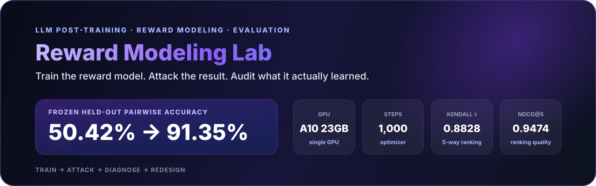
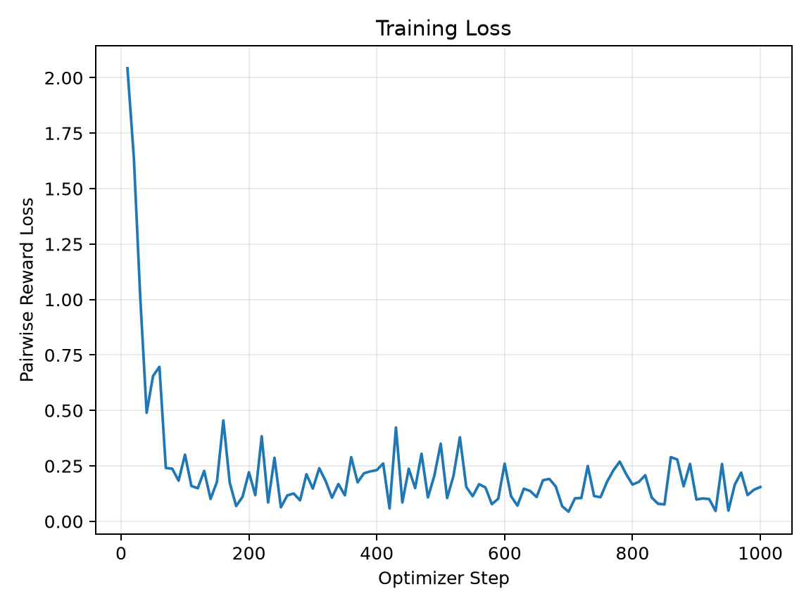
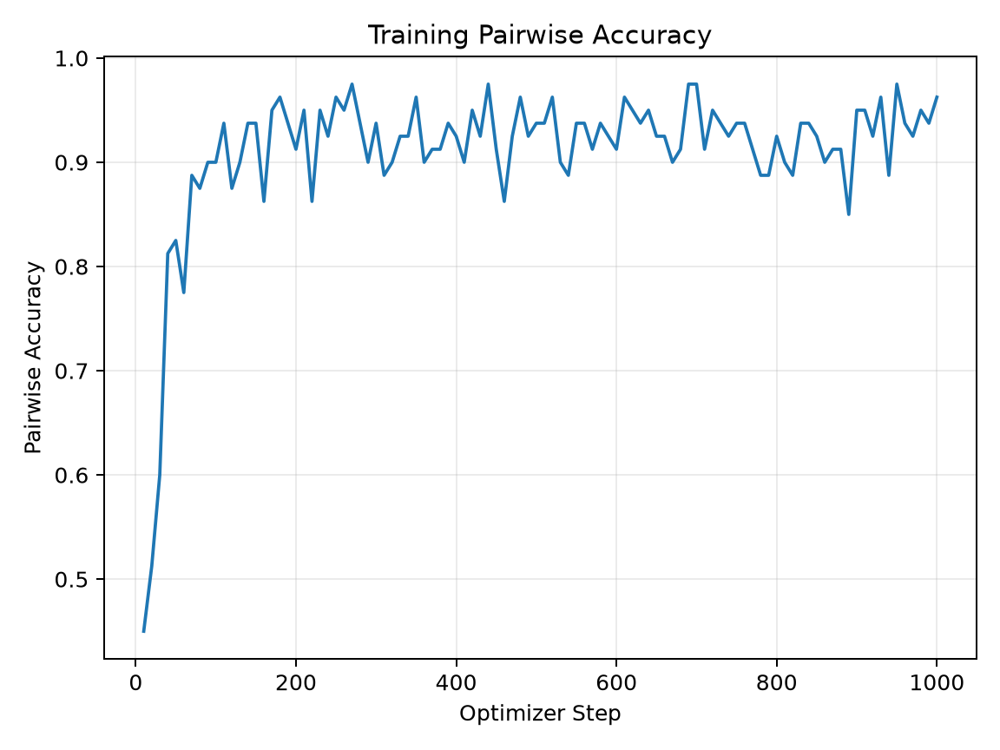
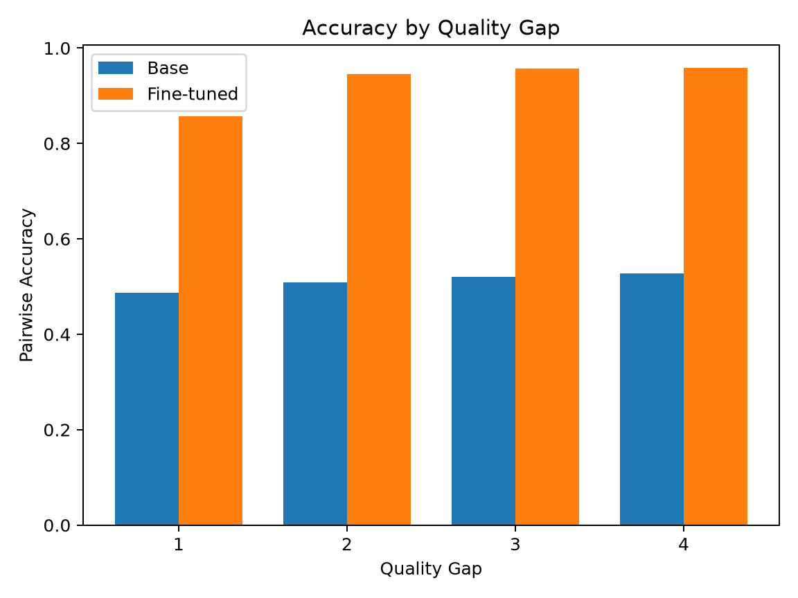
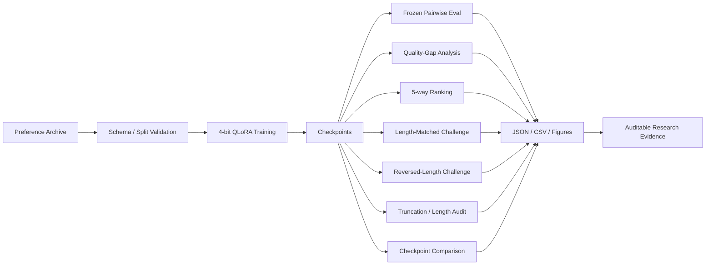

<p align="center">
  
</p>

<p align="center">
  <b>简体中文</b> · <a href="./README_EN.md">English</a> ·
  <a href="./docs/results/"><b>Verified Results</b></a> ·
  <a href="./configs/training/"><b>Training Configs</b></a> ·
  <a href="./tests/"><b>Tests</b></a>
</p>

<p align="center">
  
  
  
  
</p>

# Reward Modeling & Preference Learning

一个可审计、可复现的 **8B Reward Model 后训练与评估项目**。项目不只关心“Pairwise Accuracy 能不能训高”，而是进一步追问：

> **Reward Model 到底学到了人类偏好，还是学到了一个更容易利用的数据捷径？**

V1 基于 **Skywork Reward Llama 3.1 8B**，在单张 **NVIDIA A10 23GB** 上使用 **4-bit NF4 QLoRA + BF16 Compute** 完成真实 GPU 训练。冻结测试集上的 Pairwise Accuracy 从 **50.42% 提升到 91.35%**。

但随后出现了一个更重要的发现：一个极其简单的规则——**永远选择更长的回答**——在原始 V1 Test Distribution 上达到 **94.61%**。

这让项目从“训练成功”进入真正有研究价值的阶段：

```text
Train → Evaluate → Attack → Diagnose → Controlled Challenge → Ranking Audit → Redesign
```

---

## Research Story：为什么 91.35% 不是结论

<p align="center">
  
</p>

这张图概括了项目最重要的研究链路：

1. **Shortcut Warning**：Fine-tuned RM 达到 91.35%，但 Longer-response heuristic 达到更高的 94.61%。
2. **Controlled Challenges**：通过 Length-Matched 与 Reversed-Length Challenge 主动破坏长度捷径。
3. **Ranking Audit**：进一步使用 Kendall τ、NDCG@5、Perfect 5-way Ranking 判断 Reward Function 是否真的学到了排序能力。

核心结论不是“91.35% 很高”，而是：

> **模型确实学到了真实的 Preference Signal，但 V1 Reward Function 同时明显依赖 Length Shortcut。**

---

## 1. Executive Summary

<table>
<tr>
<td width="25%" valign="top">

### Model
**Skywork Reward Llama 3.1 8B**

4-bit NF4 QLoRA + BF16。

</td>
<td width="25%" valign="top">

### Hardware
**1× NVIDIA A10 23GB**

约 3h18m 正式训练。

</td>
<td width="25%" valign="top">

### Main Result
**50.42% → 91.35%**

冻结 Pairwise Test 绝对提升 **+40.93 pp**。

</td>
<td width="25%" valign="top">

### Main Finding
**Length Shortcut**

简单长度启发式达到 **94.61%**。

</td>
</tr>
</table>

### 已真实执行的实验范围

- Pairwise Reward Model Training
- 单张 NVIDIA A10 上的 4-bit QLoRA
- Frozen Held-out Pairwise Evaluation
- Quality-Gap Analysis
- 5-way Ranking Reconstruction
- Length Shortcut Audit
- Length-Matched Challenge
- Reversed-Length Challenge
- Truncation Analysis
- Reward-Length Correlation Analysis
- Step 800 vs Step 1000 Checkpoint Comparison
- Versioned Configs / Result Artifacts / Tests / CI

### 明确不宣称已经完成

`GRPO` · `PPO` · Multi-node Training · Multi-GPU Distributed Training · Production RM Serving Benchmark · Online RL Deployment

仓库刻意区分 **已执行实验** 与 **未来工作**。

---

## 2. 项目动机

许多 LLM Post-training 任务不存在唯一标准答案，但人类通常可以稳定表达相对偏好：

```text
Question
  ├── Response A
  └── Response B

Preference: A > B
```

Reward Model 学习标量函数：

```text
reward(question, answer) -> score
```

使 Preferred Response 的 Reward 高于 Rejected Response。

Reward Model 可用于：

- Pairwise Candidate Ranking
- Best-of-N Selection
- Preference Data Filtering
- Downstream Policy Optimization
- Agent / Trajectory Scoring
- Reward Function Diagnostics

真正困难的地方不只是训练本身。Reward Model 很可能因为错误原因得到很高的 Benchmark Score，例如依赖：

- Response Length
- Format / Style
- 固定模板
- Synthetic Data Artifact
- Generation Pipeline Bias

因此，本项目把 **Evaluation、Shortcut Attack、Ranking Audit** 放在和训练同等重要的位置。

---

## 3. Preference Data Contract

核心数据采用通用 Pairwise Preference Contract：

```json
{
  "question": "...",
  "chosen": "...",
  "rejected": "..."
}
```

V1 还保留 Question ID、Response Quality Level、Quality Gap 等元数据，用于 Ranking Reconstruction 与后续 Audit。

### 数据规模

| 数据视图 | 规模 |
|---|---:|
| Training Questions | 3,599 |
| Available Training Preference Pairs | **35,990** |
| Formal Run 实际处理 Pair Instances | **~8,000** |
| Frozen Test Questions | **451** |
| Frozen Test Pairwise Comparisons | **4,510** |
| Unique Test Responses | **2,255** |

这里必须区分：数据集中共有 **35,990** 个训练 Pair，但固定 1,000-step 的正式实验并没有完整遍历全部 Pair，只处理约 **8,000** 个 pair instances。

原始 / 私有训练数据不随公开仓库分发；公开仓库保留数据 Contract、Loader、Config、Eval Logic 与结果证据。

---

## 4. Reward Modeling Objective

每个 Preference Pair：

```text
(question, chosen, rejected)
```

Reward Model 分别输出：

```text
r_chosen   = RM(question, chosen)
r_rejected = RM(question, rejected)
```

训练目标使用 Pairwise Logistic Objective：

```text
L = -log sigmoid(r_chosen - r_rejected)
```

目标是：

```text
r_chosen > r_rejected
```

因此 Pairwise RM 真正优化的是 **Reward Difference**，而不是绝对 Reward 值是否大于 0。

---

## 5. 正式训练配置

冻结配置：

[`configs/training/formal_gpu_qlora_1000_final.json`](./configs/training/formal_gpu_qlora_1000_final.json)

| Component | Configuration |
|---|---|
| Base Model | Skywork Reward Llama 3.1 8B |
| Training Mode | `qlora_4bit` |
| Quantization | NF4 |
| Double Quantization | Enabled |
| Compute dtype | BF16 |
| TF32 | Enabled |
| Gradient Checkpointing | Enabled |
| LoRA Rank | 16 |
| LoRA Alpha | 32 |
| LoRA Dropout | 0.05 |
| Learning Rate | 1e-4 |
| Max Steps | 1,000 |
| Per-device Train Batch Size | 8 |
| Gradient Accumulation | 1 |
| Max Length | 512 |
| Seed | 42 |

LoRA Target Modules 覆盖：

```text
q_proj
k_proj
v_proj
o_proj
gate_proj
up_proj
down_proj
```

Reward `score` head 会与 LoRA adapter 一起保存。

---

## 6. 单卡训练与资源利用

正式实验运行在：

- **GPU：** NVIDIA A10 23GB
- **Wall-clock：** ~3h18m
- **Mean GPU Utilization：** ~97.7%
- **Peak Allocated Training VRAM：** ~11.85GB
- **Optimizer Steps：** 1,000

这部分不仅体现模型训练，还体现 **单卡内存约束下的训练设计与资源利用能力**。

<p align="center">
  
  
</p>

---

## 7. Frozen Held-out Result

冻结测试集：

- **451** independent questions
- **4,510** pairwise comparisons
- **2,255** unique responses

| Model | Pairwise Accuracy |
|---|---:|
| Base Reward Model | 50.42% |
| Fine-tuned Reward Model | **91.35%** |

**绝对提升：+40.93 percentage points**

<p align="center">
  
</p>

如果项目在这里停止，会得到一个很漂亮但不充分的结论：“Reward Model 训练成功”。

真正的研究价值来自下一步：**主动攻击这个结果。**

---

## 8. Quality-Gap Analysis

模型在 Preferred / Rejected 的质量差距越明显时，表现越稳定：

| Quality Gap | Base | Fine-tuned |
|---:|---:|---:|
| 1 | 48.73% | **85.64%** |
| 2 | 50.85% | **94.60%** |
| 3 | 52.00% | **95.68%** |
| 4 | 52.77% | **95.79%** |

<p align="center">
  
</p>

这说明模型确实获得了 Preference Discrimination 能力，但仍不能说明它究竟依赖什么特征完成判断。

---

## 9. Shortcut Robustness Audit

### 9.1 Longer-response Heuristic

一个完全不看语义、只选择更长回答的规则，在原始 V1 Test Distribution 上达到：

# **94.61%**

这个结果甚至高于 Fine-tuned RM 的 91.35%。

它说明原始 V1 数据中存在强烈的 Length Artifact：

```text
longer response ≈ preferred response
```

因此 IID Pairwise Accuracy 不能直接解释成“语义偏好能力”。

### 9.2 Length-Matched Challenge

控制 Preferred / Rejected 的长度差异：

| Model | Accuracy |
|---|---:|
| Base | 49.56% |
| Fine-tuned | **77.78%** |

### 9.3 Reversed-Length Challenge

故意构造：**Preferred Response 更短，Rejected Response 更长**。

| Model | Accuracy |
|---|---:|
| Base | 47.70% |
| Fine-tuned | **74.90%** |

### 9.4 结论

Fine-tuned RM 在捷径被消除或反转后仍明显高于 Base，说明模型确实学到了真实 Preference Signal。

但从 91.35% 跌到 77.78% / 74.90% 也说明：

> **V1 Reward Function 同时明显依赖 Length Shortcut。**

---

## 10. 5-way Ranking Evaluation

Pairwise Accuracy 只能回答：

```text
A > B ?
```

但真实 Reward Model 经常用于对多个 Candidate 做整体排序。因此项目把 451 个测试问题重构为 **5-way Ranking Problems**。

| Metric | Result |
|---|---:|
| Kendall τ | **0.8828** |
| NDCG@5 | **0.9474** |
| Perfect 5-way Ranking | **57.87%** |
| Level-5 Response Ranked First | **63.86%** |
| Level-1 Response Ranked Last | **95.57%** |

这些指标说明模型学到了较强的 Global Ordering Signal，同时也揭示了 Pairwise Accuracy 无法呈现的排序行为。

---

## 11. Truncation & Reward-Length Audit

正式配置使用：

```text
max_length = 512
```

后续 Token Length Audit 发现：

**约 98.54% 的 2,255 个 Unique Test Responses 在 512 tokens 下被截断。**

Reward 与完整 Response Token Length 还存在明显相关：

- **Pearson：** ~0.8204
- **Quality-level residualized Pearson：** ~0.579

这意味着 V1 同时存在两个值得继续追踪的问题：

1. 模型可能学习 Length Shortcut；
2. 512-token Context Window 可能改变 Reward Behavior。

因此 Truncation 不是一个工程细节，而是一个实验设计变量。

---

## 12. Checkpoint Selection Audit

Trainer 根据最低 Eval Loss 选择 Step 800：

| Checkpoint | Eval Loss |
|---|---:|
| Step 800 | **0.11339** |
| Step 1000 | 0.13200 |

但在同一组 2,255 Responses 上重新做 BF16 Controlled Evaluation：

| Checkpoint | Pairwise Accuracy |
|---|---:|
| Step 800 | 92.20% |
| Step 1000 | **92.64%** |

Step 1000 在 NDCG@5 与 Perfect 5-way Ranking 上也略强，而 Step 800 在部分 Rank-correlation 指标上仍略好。

因此得到另一个重要结论：

> **最低 Validation Loss 不一定对应最佳下游 Ranking Behavior。**

Reward Model 的 Checkpoint Selection 应该结合真正的 downstream usage metric。

---

## 13. Evaluation Stack



整个项目刻意遵循：

```text
Build → Run → Measure → Attack → Diagnose → Improve
```

而不是：

```text
Train once → report best score → stop
```

---

## 14. Evidence & Reproducibility

| Evidence | Verified Scope |
|---|---|
| Real GPU Training | 8B model · single A10 23GB · 1,000 steps |
| Frozen Config | version-controlled JSON training contract |
| Preference Data | 35,990 available pairs · ~8,000 processed in formal fixed-step run |
| Frozen Test | 451 questions · 4,510 comparisons · 2,255 responses |
| Shortcut Audit | length heuristic · matched-length · reversed-length |
| Ranking Audit | Kendall τ · NDCG@5 · perfect ranking · top/bottom placement |
| Context Audit | truncation rate · reward-length correlation |
| Checkpoint Audit | step 800 vs step 1000 |
| Public Artifacts | configs · figures · curated results · tests · CI |

完整公开结果包：[`docs/results/README.md`](./docs/results/README.md)

---

## 15. 这个项目证明什么

### LLM Post-training

- Pairwise Preference Learning
- Reward Modeling Objective
- 8B Model 4-bit QLoRA
- LoRA Target / Score Head Handling
- 单卡显存约束下训练
- Checkpoint & Experiment Control

### Evaluation / Research Engineering

- Frozen Held-out Evaluation
- Quality-gap Analysis
- Challenge Set Construction
- Shortcut Diagnosis
- 5-way Ranking Metrics
- Truncation Analysis
- Reward-Length Correlation
- Checkpoint Selection Audit

### Scientific Discipline

这个项目最关键的行为不是“把准确率做到 91.35%”，而是：

> **发现 94.61% 的 Shortcut Baseline 后，没有隐藏这个问题，而是用它推翻最简单的解释，然后重新设计实验。**

---

## 16. V1 已知限制

1. **Length Confounding**：V1 数据中回答长度与偏好标签高度相关。
2. **Context Truncation**：512-token limit 导致约 98.54% 的测试回答发生截断。
3. **Single Seed**：正式实验尚未形成 Multi-seed Stability 结论。
4. **Domain Case**：首个 Domain Case 为金融 QA，不宣称自动泛化到所有领域。
5. **Synthetic / Generated Artifact**：数据生成流程可能产生长度以外的 Shortcut。
6. **Checkpoint Selection**：Validation Loss 与 Ranking 指标并不完全一致。

这些限制不是 README 的免责声明，而是 V2 实验设计的直接输入。

---

## 17. V2 Roadmap

V2 的目标不是继续刷高 IID Accuracy，而是提升 **Reward Validity**。

| V2 Intervention | Purpose |
|---|---|
| Length-balanced preference data | 降低 length-label confounding |
| Concise-correct / verbose-wrong pairs | 主动打破长度捷径 |
| Semantic hard negatives | 强迫模型依赖语义质量 |
| Human-verified gold set | 降低 synthetic artifact 风险 |
| 768 / 1024 context ablation | 测量 truncation sensitivity |
| Multi-seed training | 评估 stability / variance |
| Ranking-aware checkpoint selection | 与 Reward Model 真实使用方式对齐 |

一个更可信的 V2 模型，即使 IID Accuracy 没有明显超过 V1，只要在 Controlled Challenge、Human Gold、Context Robustness 与 Multi-seed Stability 上显著改善，也应被视为科学上更好的 Reward Model。

---

## 18. 仓库结构

```text
reward-modeling-lab/
├── configs/
│   └── training/                 # frozen training configs
├── docs/
│   └── results/
│       ├── README.md             # verified result package
│       └── figures/              # training / eval / research figures
├── scripts/                      # training / evaluation utilities
├── src/                          # reward-model implementation
├── tests/                        # unit / contract tests
├── README.md                     # 中文主文档
├── README_EN.md                  # English full README
└── .github/
    ├── README.md                 # recruiter-facing landing page
    └── assets/hero.svg
```

---

## 19. 快速导航

- [Frozen Training Config](./configs/training/formal_gpu_qlora_1000_final.json)
- [Verified Results](./docs/results/README.md)
- [Result Figures](./docs/results/figures/)
- [Tests](./tests/)
- [English README](./README_EN.md)

---

## 20. License

MIT License。见 [`LICENSE`](./LICENSE)。

---

<p align="center">
  <b>A reward model is useful only if its reward survives adversarial inspection.</b>
</p>
