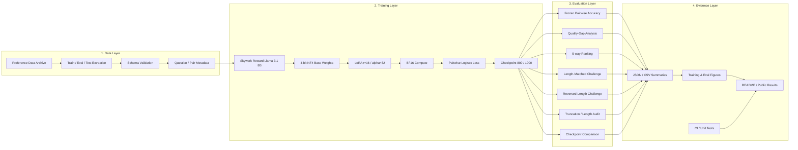
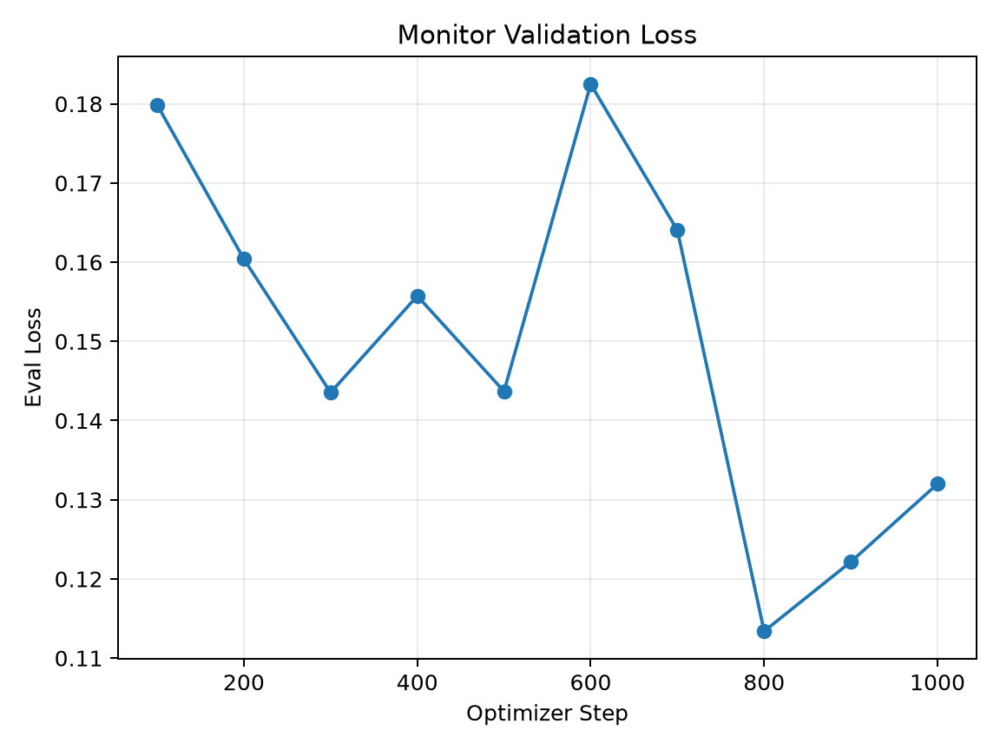
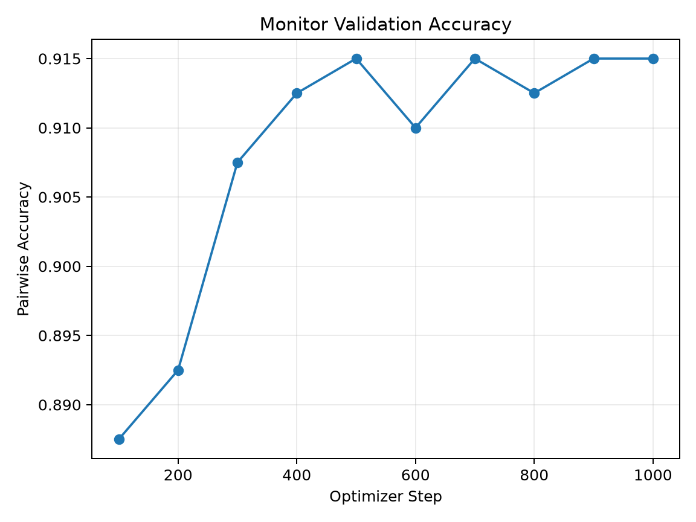

# Reward Modeling & Preference Learning

[**简体中文**](README.md) | **English**

[](https://github.com/Benjamindaoson/reward-modeling-lab/actions/workflows/ci.yml)
[](LICENSE)
[](pyproject.toml)
[](docs/results/README.md)

An auditable **8B Reward Model post-training and evaluation project** for pairwise preference learning, 4-bit QLoRA, ranking evaluation, shortcut auditing, checkpoint analysis, and reproducible experiment reporting.

The first domain case is **financial question answering**, but the public training/evaluation core is designed around a generic pairwise preference contract rather than a finance-specific model API.

---

## Executive Summary

The verified V1 experiment fine-tunes **Skywork Reward Llama 3.1 8B** on a single **NVIDIA A10 23GB** using **4-bit NF4 QLoRA with BF16 compute**.

### Headline result

| Model | Frozen Held-out Pairwise Accuracy |
|---|---:|
| Base Reward Model | 50.42% |
| Fine-tuned Reward Model | **91.35%** |

**Absolute improvement: +40.93 percentage points**

The frozen test contains **451 independent questions**, **4,510 preference pairs**, and **2,255 unique responses**.

### Why this project goes beyond a normal fine-tuning demo

The 91.35% IID result was deliberately **not** treated as the final conclusion.

A trivial heuristic that always selects the longer answer reaches **94.61%** on the original V1 test distribution, revealing a major response-length shortcut. The project therefore adds controlled challenge sets, listwise ranking metrics, truncation analysis, and checkpoint controls to test what the Reward Model actually learned.

Key validated findings:

- **Length-Matched Challenge:** 49.56% → **77.78%**
- **Reversed-Length Challenge:** 47.70% → **74.90%**
- **Kendall tau:** **0.8828**
- **NDCG@5:** **0.9474**
- **Perfect 5-way ranking:** **57.87%**
- **Overall test-response truncation at 512 tokens:** **98.54%**
- **Reward vs. full token length Pearson correlation:** **0.8204**
- **Step 800 BF16 pairwise:** 92.20%
- **Step 1000 BF16 pairwise:** **92.64%**

The central engineering lesson is:

> **Reward Modeling is not only about minimizing pairwise loss. It is about verifying that the learned reward function actually rewards the behavior we intend.**

---

## Research Story: V1 → Audit → V2

This project intentionally follows a **train → attack → diagnose → redesign** loop instead of stopping at the first strong IID score.

```mermaid
flowchart LR
    subgraph V1["V1 — Build & Train"]
        A1[35,990 Preference Pairs] --> A2[8B Reward Model]
        A2 --> A3[4-bit NF4 QLoRA + BF16]
        A3 --> A4[Single A10 23GB]
        A4 --> A5[1,000 Optimizer Steps]
        A5 --> A6[50.42% → 91.35% Pairwise]
    end

    subgraph AUDIT["Audit — Attack the Result"]
        B1[Length Heuristic = 94.61%]
        B2[Length-Matched = 77.78%]
        B3[Reversed-Length = 74.90%]
        B4[98.54% Truncation]
        B5[Reward-Length Pearson = 0.8204]
        B6[Step 800 vs Step 1000 Mismatch]
    end

    subgraph V2["V2 — Redesign for Reward Validity"]
        C1[Length-Balanced Preference Data]
        C2[Concise-Correct / Verbose-Wrong]
        C3[Semantic Hard Negatives]
        C4[Human Gold Set]
        C5[768 / 1024 Context Ablations]
        C6[Multi-Seed Validation]
        C7[Ranking-Aware Checkpoint Selection]
    end

    A6 --> B1
    B1 --> B2
    B2 --> B3
    B3 --> B4
    B4 --> B5
    B5 --> B6
    B6 --> C1
    C1 --> C2
    C2 --> C3
    C3 --> C4
    C4 --> C5
    C5 --> C6
    C6 --> C7
```



The point of V2 is **not** simply to push IID accuracy higher. A better V2 model may have similar IID accuracy while showing materially stronger controlled-challenge performance, lower reward-length dependence, lower truncation, and better multi-seed stability.

---

## Table of Contents

- [1. Project Motivation](#1-project-motivation)
- [2. Verified Scope](#2-verified-scope)
- [3. System Architecture](#3-system-architecture)
- [4. Preference Data Contract](#4-preference-data-contract)
- [5. Reward Modeling Objective](#5-reward-modeling-objective)
- [6. Training Configuration](#6-training-configuration)
- [7. Single-GPU Performance Engineering](#7-single-gpu-performance-engineering)
- [8. Formal Training Runtime](#8-formal-training-runtime)
- [9. Evaluation Stack](#9-evaluation-stack)
- [10. Frozen Held-out Results](#10-frozen-held-out-results)
- [11. Quality-Gap Analysis](#11-quality-gap-analysis)
- [12. 5-way Ranking Evaluation](#12-5-way-ranking-evaluation)
- [13. Shortcut Robustness Audit](#13-shortcut-robustness-audit)
- [14. Truncation & Length-Bias Audit](#14-truncation--length-bias-audit)
- [15. Checkpoint Selection Audit](#15-checkpoint-selection-audit)
- [16. Repository Structure](#16-repository-structure)
- [17. Installation](#17-installation)
- [18. Data Preparation](#18-data-preparation)
- [19. Running Training & Evaluation](#19-running-training--evaluation)
- [20. Configuration Files](#20-configuration-files)
- [21. Tests & CI](#21-tests--ci)
- [22. Reproducibility & Artifact Policy](#22-reproducibility--artifact-policy)
- [23. Known Limitations](#23-known-limitations)
- [24. V2 Roadmap](#24-v2-roadmap)
- [25. License](#25-license)

---

## 1. Project Motivation

In many LLM post-training problems there is no single canonical answer, but humans can still express a reliable relative preference:

```text
Question
  ├── Response A
  └── Response B

Preference: A > B
```

A Reward Model learns a scalar function:

```text
reward(question, answer) -> score
```

so that preferred answers receive higher scores than rejected answers.

This makes Reward Models useful for:

- pairwise candidate ranking,
- Best-of-N selection,
- preference-data filtering,
- downstream policy optimization,
- trajectory or response scoring,
- reward-function diagnostics.

The difficult part is not merely training the model. A Reward Model can achieve high benchmark accuracy for the wrong reason, for example by exploiting response length, formatting, style, or dataset-generation artifacts.

This repository therefore treats **evaluation and reward auditing as first-class components**, not as an afterthought.

---

## 2. Verified Scope

### What was actually executed in V1

- pairwise Reward Model training,
- 4-bit QLoRA on a single NVIDIA GPU,
- frozen held-out evaluation,
- quality-gap analysis,
- 5-way ranking reconstruction,
- length-shortcut auditing,
- Length-Matched Challenge evaluation,
- Reversed-Length Challenge evaluation,
- truncation analysis,
- reward-length correlation analysis,
- Step-800 vs Step-1000 checkpoint comparison,
- lightweight CI and unit tests,
- public experiment-result packaging.

### What is intentionally **not claimed as completed**

- GRPO training,
- PPO training,
- multi-node training,
- multi-GPU distributed training,
- production Reward Model serving benchmark,
- online RL deployment.

Keeping this boundary explicit is intentional: the repository documents only experiments that were actually executed for V1.

---

## 3. System Architecture

The verified pipeline has four layers: **data**, **training**, **evaluation**, and **evidence**.



### Layer responsibilities

1. **Data layer** — extract and validate pairwise preference records and preserve metadata needed for audits.
2. **Training layer** — load the base Reward Model, configure QLoRA, optimize pairwise reward loss, and retain checkpoints.
3. **Evaluation layer** — evaluate IID pairwise performance, quality gaps, listwise ranking, robustness challenges, truncation, and checkpoint behavior.
4. **Evidence layer** — retain lightweight metrics, figures, configs, tests, and machine-readable summaries for reproducibility.

---

## 4. Preference Data Contract

The minimum public schema is:

```json
{
  "question": "...",
  "chosen": "...",
  "rejected": "..."
}
```

The V1 experimental data additionally contains metadata such as question IDs, response-quality levels, and quality gaps for ranking and audit analysis.

The data loader validates that each record contains non-empty string values for:

```text
question
chosen
rejected
```

The public extraction utility expects an archive containing train/eval/test JSONL preference splits and extracts only the required files into `data/preferences/`.

### V1 dataset scale

| Split / View | Size |
|---|---:|
| Training questions | 3,599 |
| Training preference pairs available | **35,990** |
| Formal run pair instances processed | **~8,000** |
| Frozen test questions | **451** |
| Frozen test pairwise comparisons | **4,510** |
| Unique test responses | **2,255** |

The distinction between **available training pairs** and **actually processed pair instances** is important: the fixed 1,000-step run did not make a full pass over all 35,990 pairs.

Raw/private training data is intentionally not distributed in this repository.

---

## 5. Reward Modeling Objective

For each preference pair:

```text
(question, chosen, rejected)
```

the Reward Model produces two scalar scores:

```text
r_chosen   = RM(question, chosen)
r_rejected = RM(question, rejected)
```

Training minimizes the pairwise logistic objective:

```text
L = -log sigmoid(r_chosen - r_rejected)
```

The model is therefore optimized for:

```text
r_chosen > r_rejected
```

The absolute reward zero-point is not constrained. A chosen answer can have a negative score and still be ranked correctly as long as it receives a higher score than the rejected answer.

---

## 6. Training Configuration

The frozen formal configuration is available at:

[`configs/training/formal_gpu_qlora_1000_final.json`](configs/training/formal_gpu_qlora_1000_final.json)

### Model / precision

| Parameter | Value |
|---|---|
| Base model | Skywork Reward Llama 3.1 8B |
| Training mode | `qlora_4bit` |
| Weight storage | 4-bit |
| Quantization type | NF4 |
| Double quantization | Enabled |
| Compute dtype | BF16 |
| TF32 | Enabled |
| Gradient checkpointing | Enabled |

### LoRA

| Parameter | Value |
|---|---:|
| Rank `r` | 16 |
| Alpha | 32 |
| Dropout | 0.05 |
| Modules to save | `score` |

Target modules:

```text
q_proj
k_proj
v_proj
o_proj
gate_proj
up_proj
down_proj
```

### Optimization

| Parameter | Value |
|---|---:|
| Learning rate | `1e-4` |
| Max optimizer steps | 1,000 |
| Weight decay | 0.01 |
| Warmup ratio | 0.05 |
| Max grad norm | 1.0 |
| Seed | 42 |
| Train micro-batch | 8 |
| Gradient accumulation | 1 |
| Effective batch size | **8** |
| Eval batch size | 8 |
| Logging interval | 10 steps |
| Eval interval | 100 steps |
| Save interval | 100 steps |
| Save total limit | 2 |
| Max sequence length | **512** |

---

## 7. Single-GPU Performance Engineering

The formal model was trained on a **single NVIDIA A10 23GB**.

Before freezing the final batch configuration, several micro-batch / gradient-accumulation combinations were profiled while holding the effective batch size at 8.

| Micro-batch | Grad Accum | Effective Batch | Approx. sec / step |
|---:|---:|---:|---:|
| 1 | 8 | 8 | 13.92 |
| 2 | 4 | 8 | 11.59 |
| 4 | 2 | 8 | 10.90 |
| **8** | **1** | **8** | **10.45** |

The final configuration used:

```text
per_device_train_batch_size = 8
gradient_accumulation_steps = 1
```

Compared with micro-batch 1 / accumulation 8, this reduced approximate step time by about 25% while preserving the same effective batch size.

The goal was not to maximize memory consumption, but to find a simple single-GPU configuration that kept the accelerator busy without unnecessary accumulation overhead.

---

## 8. Formal Training Runtime

| Metric | Value |
|---|---:|
| Hardware | NVIDIA A10 23GB |
| Optimizer steps | **1,000** |
| Effective batch | 8 |
| Approx. pair instances processed | **8,000** |
| Wall-clock time | **03:18:51** |
| Mean GPU utilization | **97.73%** |
| Peak allocated training VRAM | **~11.85GB** |

This is the main cost-efficiency result of the engineering path: an 8B Reward Model was adapted on a single 23GB GPU without multi-GPU infrastructure.

---

## 9. Evaluation Stack

V1 evaluates Reward Model quality at multiple levels.

### Level 1 — Frozen IID pairwise evaluation

Measures whether:

```text
reward(chosen) > reward(rejected)
```

on unseen held-out preference pairs.

### Level 2 — Quality-gap evaluation

Measures how accuracy and reward margin change as the underlying preference difference becomes larger.

### Level 3 — 5-way ranking evaluation

Reconstructs five response-quality levels per question and evaluates listwise ordering using:

- Kendall tau,
- Spearman rank correlation,
- NDCG@5,
- top-1 / bottom-1 accuracy,
- perfect 5-way ranking.

### Level 4 — Shortcut robustness

Tests whether the Reward Model still performs when the strongest obvious shortcut — response length — is controlled or reversed.

### Level 5 — Bias diagnostics

Measures:

- truncation rate,
- reward-length correlation,
- checkpoint disagreement,
- validation-loss vs ranking-metric mismatch.

---

## 10. Frozen Held-out Results

The frozen test set contains:

- **451 independent questions**,
- **4,510 preference pairs**,
- **2,255 unique responses**.

| Metric | Base | Fine-tuned |
|---|---:|---:|
| Pairwise Accuracy | 50.42% | **91.35%** |
| Mean Reward Margin | 0.487 | **11.284** |

Absolute pairwise improvement:

```text
+40.93 percentage points
```


### Training curves


### Monitor curves





---

## 11. Quality-Gap Analysis

A larger quality gap should generally make the preference easier to identify.

| Quality Gap | Records | Base Accuracy | Fine-tuned Accuracy | Fine-tuned Mean Margin |
|---:|---:|---:|---:|---:|
| 1 | 1,804 | 48.73% | **85.64%** | 5.60 |
| 2 | 1,353 | 50.85% | **94.60%** | 11.33 |
| 3 | 902 | 52.00% | **95.68%** | 17.00 |
| 4 | 451 | 52.77% | **95.79%** | 22.41 |


The monotonic increase in fine-tuned reward margin is useful evidence that the model learned an ordinal preference structure rather than only a binary boundary.

---

## 12. 5-way Ranking Evaluation

The 451 questions were reconstructed as five-response ranking tasks.

Selected-model results:

| Metric | Result |
|---|---:|
| Pairwise Accuracy | ~91.37% |
| Kendall tau | **0.8828** |
| NDCG@5 | **0.9474** |
| Perfect 5-way ranking | **57.87%** |
| Level-5 response ranked first | **63.86%** |
| Level-1 response ranked last | **95.57%** |

Why this matters:

A model can obtain high pairwise accuracy while still producing inconsistent global rankings. Listwise metrics expose whether the learned reward surface preserves the intended ordering across all five quality levels.

The primary resume / headline metric remains the frozen A10 pairwise result **50.42% → 91.35%**; the ranking metrics are reported as complementary evidence.

---

## 13. Shortcut Robustness Audit

### Discovery: the original dataset has a strong length shortcut

A trivial heuristic:

```text
choose whichever response is longer
```

achieves:

```text
94.61% accuracy
```

on the original V1 test distribution.

That result is higher than the fine-tuned IID Reward Model accuracy, so the IID result alone cannot be interpreted as unbiased semantic preference accuracy.

### Length-Matched Challenge

Selection rule:

```text
relative chosen/rejected length difference <= 10%
```

Challenge composition:

- **450 pairs**,
- **340 unique questions**,
- 442 Gap-1 pairs,
- 8 Gap-2 pairs.

| Model | Accuracy | Mean Reward Margin |
|---|---:|---:|
| Base | 49.56% | 0.05 |
| Fine-tuned | **77.78%** | **4.21** |

Absolute improvement:

```text
+28.22 percentage points
```

### Reversed-Length Challenge

Selection rule:

```text
chosen response is shorter than rejected response
```

Challenge composition:

- **239 pairs**,
- **205 unique questions**,
- all 239 pairs are Gap 1,
- length-only heuristic accuracy = **0%**.

| Model | Accuracy | Mean Reward Margin |
|---|---:|---:|
| Base | 47.70% | -0.20 |
| Fine-tuned | **74.90%** | **3.68** |

Absolute improvement:

```text
+27.20 percentage points
```

### Interpretation

The challenge results support two conclusions simultaneously:

1. the V1 preference protocol contains a **significant length artifact**;
2. the fine-tuned Reward Model still retains **substantial ranking ability after suppressing or reversing the length shortcut**.

Because the challenge sets are concentrated on hard Gap-1 examples, the IID-to-challenge drop should not be attributed to length bias alone.

---

## 14. Truncation & Length-Bias Audit

The formal experiment used:

```text
max_length = 512
```

A later full token-length audit found that approximately:

```text
98.54%
```

of the **2,255 unique test responses** were truncated.

This is one of the most important V1 limitations.

Additional diagnostics:

| Diagnostic | Value |
|---|---:|
| Reward vs full token length Pearson | **0.8204** |
| Quality-level residualized Pearson | **0.5791** |

Interpretation:

- high-quality labels and response length are entangled in V1,
- the Reward Model also exhibits strong reward-length association,
- increasing model quality therefore requires fixing both **data construction** and **context-length handling**.

This finding is intentionally reported rather than hidden behind the 91.35% IID score.

---

## 15. Checkpoint Selection Audit

The trainer selected Step 800 because it had the lowest monitor evaluation loss:

| Checkpoint | Eval Loss |
|---|---:|
| Step 800 | **0.11339** |
| Step 1000 | 0.13200 |

A later controlled BF16 evaluation scored the same 2,255 responses with a consistent base-model environment.

| Metric | Base BF16 | Step 800 | Step 1000 |
|---|---:|---:|---:|
| Pairwise Accuracy | 52.24% | 92.20% | **92.64%** |
| Kendall tau | 0.0515 | **0.8875** | 0.8853 |
| Spearman | 0.0638 | **0.9417** | 0.9329 |
| NDCG@5 | 0.7379 | 0.9489 | **0.9501** |
| Level-5 Top-1 | 17.74% | 65.63% | **67.85%** |
| Perfect 5-way | 2.00% | 59.65% | **63.41%** |

Direct Step-800 vs Step-1000 comparison:

- pair-ranking disagreements: **84 / 4,510**,
- questions where Step 1000 has higher pairwise accuracy: **33**,
- questions where Step 800 is better: **13**,
- questions with equal pairwise accuracy: **405**.

The main conclusion is not that Step 1000 is universally superior. Instead:

> **The checkpoint with the lowest validation loss is not necessarily the checkpoint with the best downstream ranking behavior.**

This motivates ranking-aware checkpoint selection in V2.

---

## 16. Repository Structure

```text
.
├── .github/
│   └── workflows/
│       └── ci.yml
├── configs/
│   └── training/
│       ├── formal_gpu_qlora_1000_final.json
│       ├── single_gpu_qlora.json
│       ├── smoke_gpu_qlora.json
│       └── speed_probe_*.json
├── docs/
│   └── results/
│       ├── README.md
│       ├── data/
│       └── figures/
├── scripts/
│   ├── run_all_on_gpu.sh
│   └── setup_gpu_environment.sh
├── src/
│   └── financial_reward_rl/
│       ├── cli.py
│       ├── data.py
│       ├── evaluate.py
│       ├── evaluation_suite.py
│       ├── model_artifacts.py
│       ├── model_setup.py
│       ├── preflight.py
│       └── train.py
├── tests/
│   ├── test_model_artifacts.py
│   └── test_single_gpu_qlora.py
├── LICENSE
├── pyproject.toml
└── README.md
```

### Important modules

- `data.py` — preference split extraction, JSONL validation, data summaries.
- `preflight.py` — training-environment and input-path readiness checks.
- `model_setup.py` — base-model setup helpers.
- `model_artifacts.py` — base / adapter artifact resolution.
- `train.py` — QLoRA loading plan, pairwise reward training, checkpointing.
- `evaluate.py` — held-out pairwise evaluation entry point.
- `evaluation_suite.py` — extended ranking and audit utilities used by the experiment workflow.

---

## 17. Installation

### Requirements

- Python **3.11+**
- NVIDIA GPU for the published 4-bit QLoRA path
- CUDA-compatible PyTorch
- local or downloaded base Reward Model

### Create environment

```bash
python -m venv .venv
source .venv/bin/activate
python -m pip install --upgrade pip
```

### Install package

```bash
pip install -e ".[train]"
```

The `train` optional dependency set includes the training stack such as PyTorch, Transformers, PEFT, bitsandbytes, Accelerate, datasets, and related utilities.

For GPU environments, install the correct PyTorch build for the local CUDA driver before running the training pipeline.

---

## 18. Data Preparation

The end-to-end script expects a preference-data archive:

```bash
export PREFERENCE_DATA_ARCHIVE=/path/to/preference_data.zip
```

The CLI extracts the train / eval / test splits into:

```text
data/preferences/
```

You can also run the data commands independently.

### Extract data

```bash
reward-modeling prepare-data \
  --archive /path/to/preference_data.zip \
  --output-dir data/preferences
```

### Validate / summarize a split

```bash
reward-modeling summarize-data \
  --data data/preferences/train.jsonl
```

The raw V1 training dataset is not included in this repository.

---

## 19. Running Training & Evaluation

### Base model

Point the pipeline at a local Reward Model directory:

```bash
export MODEL_PATH=/path/to/base-reward-model
```

### Optional training config

By default the public runner uses:

```text
configs/training/single_gpu_qlora.json
```

Override it with:

```bash
export TRAINING_CONFIG=configs/training/formal_gpu_qlora_1000_final.json
```

### Run the complete single-GPU path

```bash
bash scripts/run_all_on_gpu.sh
```

The script performs:

```text
prepare data
    -> summarize data
    -> GPU/model preflight
    -> single-GPU Reward Model training
    -> held-out evaluation
```

### Resume from checkpoint

```bash
export RESUME_FROM_CHECKPOINT=/path/to/checkpoint
bash scripts/run_all_on_gpu.sh
```

### Optional environment setup

The runner can invoke the setup helper if requested:

```bash
export AUTO_SETUP=1
export TORCH_INDEX_URL=<cuda-compatible-pytorch-index>
bash scripts/run_all_on_gpu.sh
```

---

## 20. Configuration Files

The repository keeps separate configs for different experiment purposes.

| Config | Purpose |
|---|---|
| `single_gpu_qlora.json` | default public single-GPU QLoRA path |
| `formal_gpu_qlora_1000_final.json` | frozen formal V1 configuration |
| `smoke_gpu_qlora.json` | short smoke validation |
| `speed_probe_batch2.json` | batch profiling |
| `speed_probe_batch4.json` | batch profiling |
| `speed_probe_batch8.json` | batch profiling |
| `speed_probe_evalbatch8.json` | evaluation-batch profiling |

Keeping profiling, smoke, and formal configs separate makes it easier to distinguish **engineering checks** from **reported experiment results**.

---

## 21. Tests & CI

GitHub Actions runs on pushes and pull requests to `main`.

The current CI matrix covers:

```text
Python 3.11
Python 3.12
```

CI performs:

1. repository checkout,
2. Python setup,
3. editable package installation,
4. unit-test discovery under `tests/`,
5. compilation of public Python sources.

Current lightweight tests cover:

- adapter/base-model artifact resolution,
- QLoRA loading-plan configuration,
- NF4 settings,
- LoRA rank configuration,
- full-precision flag behavior.

The CI intentionally does **not** attempt an 8B GPU training run on GitHub-hosted CPU runners.

---

## 22. Reproducibility & Artifact Policy

The public repository includes lightweight artifacts that allow the main findings to be inspected without distributing model weights or private data.

Included:

- frozen training configs,
- result summaries,
- quality-gap CSV,
- shortcut-audit JSON,
- checkpoint-comparison JSON,
- training / evaluation figures,
- unit tests,
- CI workflow.

Excluded from Git:

- base-model weights,
- LoRA adapter checkpoints,
- optimizer states,
- raw/private preference data,
- large local experiment archives,
- runtime logs and caches.

Detailed public results are available in:

**[docs/results/README.md](docs/results/README.md)**

Machine-readable result summaries are available under:

```text
docs/results/data/
```

---

## 23. Known Limitations

V1 deliberately documents its failure modes.

### 1. Strong length artifact in the preference protocol

The longer-response heuristic reaches 94.61%, demonstrating that answer length is highly correlated with the preference label.

### 2. Severe truncation at 512 tokens

98.54% of unique test responses exceed the formal context budget and are truncated.

### 3. Synthetic preference artifacts may extend beyond length

Length is the best-audited shortcut in V1, but formatting, style, and generation-template artifacts may also exist.

### 4. One formal random seed

The frozen formal experiment uses seed 42. Multi-seed stability is a V2 requirement.

### 5. Hyperparameter search is intentionally limited

The project contains targeted performance profiling, but V1 is not a full LR / rank / context grid search.

### 6. Fixed-step training does not consume the full dataset

1,000 optimizer steps at effective batch 8 correspond to roughly 8,000 pair instances, versus 35,990 available training pairs.

### 7. Early-stopping configuration was ineffective

With evaluation every 100 steps and only 1,000 total steps, a patience of 20 could not meaningfully trigger within this run.

These are not hidden caveats; they are part of the experiment's main conclusions.

---

## 24. V2 Roadmap

V2 is designed around **better reward validity**, not simply a higher IID score.

### Data

- length-balanced preference pairs,
- concise-correct vs verbose-wrong pairs,
- reversed-length hard negatives,
- semantic hard negatives,
- format-controlled examples,
- human-verified gold evaluation set.

### Context

Ablate:

```text
512
768
1024
```

and extend further if truncation remains high.

### Stability

Run multiple seeds, for example:

```text
42
123
2026
```

and report mean ± standard deviation.

### Checkpoint selection

Replace loss-only checkpoint selection with ranking-aware evaluation using combinations of:

- pairwise accuracy,
- NDCG@5,
- Kendall tau,
- challenge-set accuracy,
- robustness guardrails.

### Success criterion

A V2 model can be considered better even if IID accuracy is similar or slightly lower, provided that:

- controlled challenge accuracy improves,
- human-gold accuracy improves,
- reward-length dependence drops,
- truncation is reduced,
- results are stable across seeds.

---

## 25. License

Released under the [MIT License](LICENSE).

---

## Results at a Glance

| Category | Metric | Result |
|---|---|---:|
| Formal | Base Pairwise Accuracy | 50.42% |
| Formal | Fine-tuned Pairwise Accuracy | **91.35%** |
| Formal | Absolute Improvement | **+40.93pp** |
| Ranking | Kendall tau | **0.8828** |
| Ranking | NDCG@5 | **0.9474** |
| Ranking | Perfect 5-way | **57.87%** |
| Shortcut | Longer-answer heuristic | **94.61%** |
| Robustness | Length-Matched Fine-tuned | **77.78%** |
| Robustness | Reversed-Length Fine-tuned | **74.90%** |
| Bias | Overall truncation | **98.54%** |
| Bias | Reward-token Pearson | **0.8204** |
| Checkpoint | Step 800 BF16 Pairwise | 92.20% |
| Checkpoint | Step 1000 BF16 Pairwise | **92.64%** |
| Training | Wall-clock time | **03:18:51** |
| Training | Mean GPU utilization | **97.73%** |
| Training | Peak allocated VRAM | **~11.85GB** |

> **Core lesson:** A high Reward Model score is only useful if we can explain what the model is actually rewarding.
